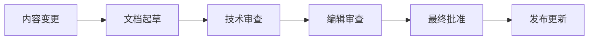

# 📚 MCP Academic RAG Server 文档策略与维护计划

## 🎯 文档策略概述

**目标**: 建立企业级文档体系，确保项目的可维护性和可扩展性  
**策略**: 分层文档架构 + 自动化维护 + 持续改进  
**负责人**: 项目团队 + 文档专员  
**更新周期**: 每次发布前强制更新，每季度全面评审

---

## 📊 当前文档现状分析

### 现有文档资产
- **总文档数**: 47个Markdown文件
- **覆盖类型**: 用户指南、开发文档、API参考、部署指南
- **质量等级**: 中等 (需要标准化和系统化)

### 文档分布
```
docs/
├── api-reference.md              # API接口文档
├── developer-guide.md            # 开发者指南
├── quickstart-guide.md           # 快速开始
├── user-guide/                   # 用户指南目录
├── archived/                     # 已归档文档
└── workflow-command-design.md    # 工作流命令设计

根目录:
├── README.md                     # 项目主页
├── CHANGELOG.md                  # 变更日志
├── CONTRIBUTING.md               # 贡献指南
├── PROJECT_STRUCTURE.md          # 项目结构说明
└── ANALYSIS_REPORT.md            # 项目分析报告
```

### 文档质量问题
1. **不一致性**: 格式、风格、术语使用不统一
2. **更新滞后**: 部分文档与代码不同步
3. **覆盖不全**: API文档自动化程度低
4. **查找困难**: 缺乏统一的文档索引和导航

---

## 🏗️ 文档架构重新设计

### 分层文档体系

#### 第一层: 项目入口文档
```
根目录/
├── README.md                     # 项目概览和快速开始
├── CHANGELOG.md                  # 版本变更记录
├── CONTRIBUTING.md               # 贡献者指南
├── CODE_OF_CONDUCT.md           # 行为准则 (新增)
├── SECURITY.md                   # 安全政策 (新增)
└── LICENSE                       # 开源协议
```

#### 第二层: 用户文档
```
docs/user/
├── quickstart.md                 # 5分钟快速开始
├── installation.md               # 详细安装指南
├── configuration.md              # 配置参考
├── api-usage.md                  # API使用指南
├── troubleshooting.md            # 故障排除
├── faq.md                        # 常见问题
├── examples/                     # 使用示例
│   ├── basic-rag-query.md
│   ├── multi-model-setup.md
│   └── advanced-configuration.md
└── migration/                    # 迁移指南
    ├── v1-to-v2.md
    └── config-migration.md
```

#### 第三层: 开发者文档
```
docs/developer/
├── architecture.md               # 系统架构设计
├── development-setup.md          # 开发环境搭建
├── coding-standards.md           # 编码规范
├── testing-guide.md              # 测试指南
├── performance-optimization.md   # 性能优化指南
├── security-guidelines.md        # 安全开发指南
├── api-design-principles.md      # API设计原则
├── database-design.md            # 数据库设计
├── deployment/                   # 部署文档
│   ├── docker.md
│   ├── kubernetes.md
│   └── production-checklist.md
└── extensions/                   # 扩展开发
    ├── custom-processors.md
    ├── new-llm-connectors.md
    └── vector-store-backends.md
```

#### 第四层: API参考文档
```
docs/api/
├── openapi.yaml                  # OpenAPI 3.0规范
├── rest-api.md                   # REST API文档
├── mcp-tools.md                  # MCP工具参考
├── webhooks.md                   # Webhook文档
├── authentication.md             # 认证机制
├── rate-limiting.md              # 限流规则
├── error-codes.md                # 错误代码参考
└── sdk/                          # SDK文档
    ├── python-sdk.md
    ├── javascript-sdk.md
    └── curl-examples.md
```

#### 第五层: 运维文档
```
docs/operations/
├── monitoring.md                 # 监控指南
├── logging.md                    # 日志管理
├── backup-recovery.md            # 备份恢复
├── security-hardening.md         # 安全加固
├── performance-tuning.md         # 性能调优
├── disaster-recovery.md          # 灾难恢复
├── capacity-planning.md          # 容量规划
└── maintenance/                  # 维护文档
    ├── routine-tasks.md
    ├── database-maintenance.md
    └── upgrade-procedures.md
```

---

## 🤖 文档自动化策略

### 1. API文档自动生成

#### OpenAPI规范集成
```yaml
# .github/workflows/docs.yml
name: Generate API Documentation
on:
  push:
    branches: [main]
    paths: ['**/*.py']

jobs:
  generate-docs:
    runs-on: ubuntu-latest
    steps:
      - uses: actions/checkout@v3
      - name: Generate OpenAPI spec
        run: |
          python scripts/generate_openapi.py > docs/api/openapi.yaml
      - name: Generate API docs
        run: |
          swagger-codegen generate -i docs/api/openapi.yaml -l html2 -o docs/api/generated
```

#### Docstring到文档转换
```python
# scripts/generate_api_docs.py
"""
自动从代码注释生成API文档
"""
import ast
import inspect
from typing import Dict, List

class APIDocGenerator:
    def extract_docstrings(self, module_path: str) -> Dict:
        """提取模块中的docstring"""
        pass
    
    def generate_markdown(self, docstrings: Dict) -> str:
        """生成Markdown格式的API文档"""
        pass
```

### 2. 代码示例验证

#### 示例代码自动测试
```python
# tests/test_documentation_examples.py
import pytest
import subprocess
from pathlib import Path

class TestDocumentationExamples:
    """确保文档中的代码示例能正常运行"""
    
    def test_quickstart_examples(self):
        """测试快速开始指南中的示例"""
        pass
    
    def test_api_usage_examples(self):
        """测试API使用指南中的示例"""
        pass
```

### 3. 文档同步检查

#### CI/CD文档验证
```bash
#!/bin/bash
# scripts/validate_docs.sh

echo "🔍 检查文档同步性..."

# 检查API文档是否与代码同步
python scripts/check_api_sync.py

# 检查配置文档是否与schema同步
python scripts/check_config_sync.py

# 检查示例代码是否可执行
python scripts/validate_examples.py

# 检查文档链接有效性
markdown-link-check docs/**/*.md

echo "✅ 文档验证完成"
```

---

## 📝 内容标准化指南

### 文档模板

#### API文档模板
```markdown
# API名称

## 概述
简短描述API的用途和功能。

## 认证
描述所需的认证方式。

## 请求格式
\```http
POST /api/endpoint
Content-Type: application/json
Authorization: Bearer <token>

{
  "parameter": "value"
}
\```

## 响应格式
\```json
{
  "status": "success",
  "data": {...},
  "meta": {...}
}
\```

## 错误处理
| 错误代码 | 描述 | 解决方案 |
|---------|------|----------|
| 400 | 请求参数错误 | 检查请求格式 |

## 示例
提供完整的使用示例。

## 相关文档
链接到相关文档。
```

#### 开发指南模板
```markdown
# 功能名称开发指南

## 前言
简要说明本指南的目的和适用范围。

## 准备工作
- 环境要求
- 依赖安装
- 配置设置

## 实现步骤
1. 步骤一
2. 步骤二
3. 步骤三

## 最佳实践
- 建议一
- 建议二

## 常见问题
- 问题和解决方案

## 进一步阅读
相关资源链接。
```

### 写作风格指南

#### 语言和语调
- **简洁明了**: 避免冗长的句子和复杂的术语
- **友好专业**: 使用积极的语调，避免命令式表达
- **一致性**: 统一使用术语和表达方式

#### 格式规范
- **标题层级**: 使用一致的标题格式 (H1-H6)
- **代码块**: 指定语言类型，确保语法高亮
- **链接**: 使用描述性的链接文本
- **图片**: 提供alt文本，使用相对路径

#### 术语词汇表
```markdown
# 术语词汇表

- **MCP**: Model Context Protocol，模型上下文协议
- **RAG**: Retrieval-Augmented Generation，检索增强生成
- **向量存储**: Vector Store，用于存储和检索向量嵌入的系统
- **LLM**: Large Language Model，大型语言模型
```

---

## 🔄 文档维护流程

### 日常维护流程

#### 1. 内容更新触发器
- **代码变更**: 当API或配置发生变化时
- **功能发布**: 新功能发布前必须更新相关文档
- **Bug修复**: 重要bug修复需要更新故障排除文档
- **用户反馈**: 根据用户反馈改进文档内容

#### 2. 更新审查流程


#### 3. 质量控制检查点
- **技术准确性**: 代码示例和配置是否正确
- **完整性**: 是否涵盖了所有必要信息
- **可读性**: 是否易于理解和跟随
- **一致性**: 是否符合风格指南

### 定期维护任务

#### 月度任务
- [ ] 检查并修复失效链接
- [ ] 更新FAQ和故障排除指南
- [ ] 收集和分析用户反馈
- [ ] 验证代码示例的有效性

#### 季度任务
- [ ] 全面审查文档架构
- [ ] 更新术语词汇表
- [ ] 评估文档使用情况和效果
- [ ] 规划下一季度的文档改进

#### 年度任务
- [ ] 文档策略全面评估
- [ ] 用户满意度调查
- [ ] 文档工具链升级
- [ ] 长期规划制定

---

## 📊 文档效果评估

### 关键指标 (KPIs)

#### 内容质量指标
- **准确性**: 文档错误报告数量 < 5/季度
- **完整性**: API文档覆盖率 = 100%
- **时效性**: 文档更新延迟 < 48小时
- **可用性**: 用户任务完成率 > 90%

#### 用户体验指标
- **查找效率**: 平均查找时间 < 2分钟
- **用户满意度**: 满意度评分 > 4.5/5.0
- **支持请求**: 文档相关支持请求减少30%
- **新用户上手**: 快速开始完成率 > 80%

#### 维护效率指标
- **更新频率**: 平均更新周期 < 1周
- **审查时间**: 文档审查时间 < 2工作日
- **自动化程度**: 自动生成文档比例 > 60%
- **维护成本**: 文档维护工时占比 < 10%

### 反馈收集机制

#### 用户反馈渠道
1. **文档页面反馈**: 每个页面底部的反馈表单
2. **GitHub Issues**: 专门的文档改进标签
3. **用户调研**: 定期的用户体验调研
4. **社区讨论**: 开发者论坛和聊天群组

#### 反馈处理流程
```yaml
反馈收集 → 分类筛选 → 优先级排序 → 任务分配 → 实施改进 → 效果评估
```

---

## 🛠️ 技术工具链

### 文档工具栈

#### 编写和编辑
- **编辑器**: VS Code + Markdown插件
- **语法检查**: markdownlint + Vale
- **协作**: GitHub + Pull Request审查
- **预览**: GitBook 或 Docusaurus

#### 自动化工具
- **API文档**: OpenAPI Generator + Swagger UI
- **链接检查**: markdown-link-check
- **拼写检查**: cspell
- **格式化**: Prettier

#### 部署和托管
- **静态站点**: GitHub Pages 或 Netlify
- **搜索功能**: Algolia DocSearch
- **分析**: Google Analytics
- **CDN**: CloudFlare

### 集成开发环境

#### VS Code配置
```json
{
  "recommendations": [
    "yzhang.markdown-all-in-one",
    "davidanson.vscode-markdownlint",
    "streetsidesoftware.code-spell-checker",
    "bierner.markdown-mermaid"
  ],
  "settings": {
    "markdown.preview.breaks": true,
    "markdown.preview.linkify": true
  }
}
```

---

## 🚀 实施计划

### 第一阶段: 基础建设 (2周)
- [ ] 建立新的文档目录结构
- [ ] 迁移现有文档到新结构
- [ ] 设置自动化工具链
- [ ] 编写文档标准和模板

### 第二阶段: 内容完善 (3周)
- [ ] 重写核心用户文档
- [ ] 生成完整的API参考文档
- [ ] 创建开发者指南
- [ ] 建立运维文档体系

### 第三阶段: 自动化集成 (1周)
- [ ] 配置CI/CD文档验证
- [ ] 实现API文档自动生成
- [ ] 设置文档同步检查
- [ ] 部署文档网站

### 第四阶段: 优化改进 (持续)
- [ ] 收集用户反馈
- [ ] 监控文档使用情况
- [ ] 持续改进内容质量
- [ ] 扩展高级功能

---

## 📋 成功标准

### 短期目标 (1个月)
- ✅ 建立完整的文档架构
- ✅ 实现50%的API文档自动化
- ✅ 用户满意度提升到4.0+
- ✅ 文档错误报告减少50%

### 中期目标 (3个月)
- ✅ 实现80%的文档自动化
- ✅ 新用户上手成功率>80%
- ✅ 支持请求减少30%
- ✅ 文档贡献者增加到5+人

### 长期目标 (6个月)
- ✅ 成为开源项目文档标杆
- ✅ 用户满意度达到4.5+
- ✅ 文档维护成本降低40%
- ✅ 社区贡献活跃度提升

---

**文档策略版本**: 1.0  
**制定日期**: 2025-08-15  
**负责团队**: 项目核心团队  
**下次评审**: 2025-11-15