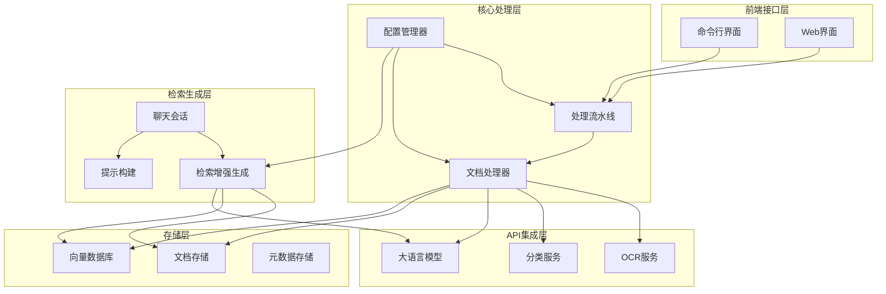
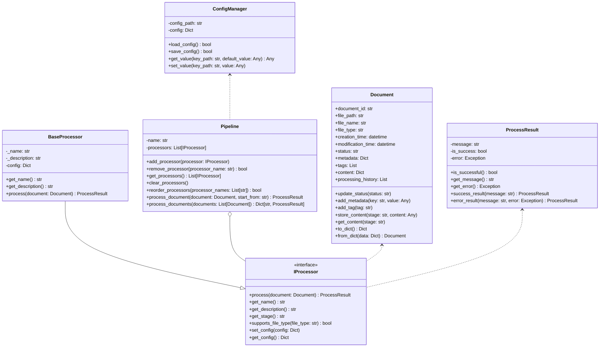
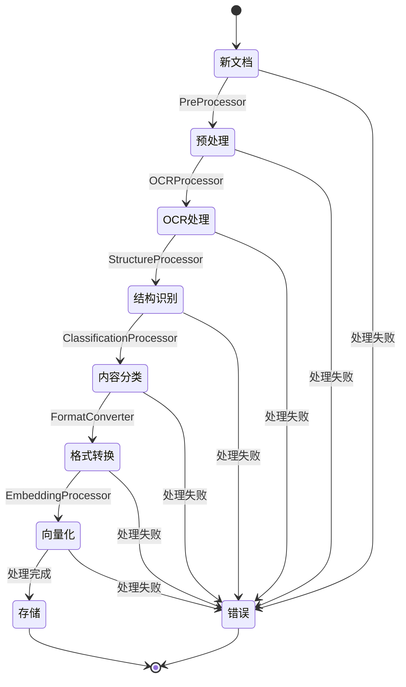
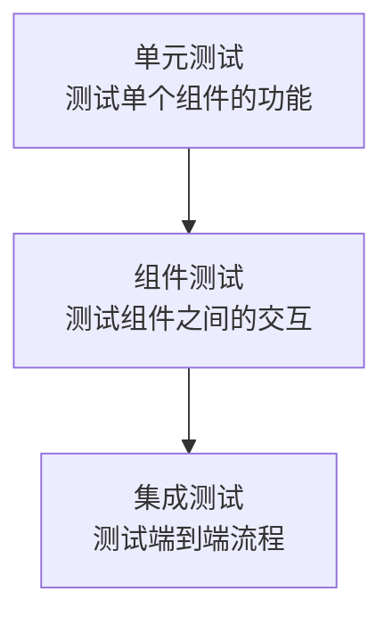

# 学术文献RAG服务器

这是一个学术文献检索增强生成(RAG)服务器原型，提供文献OCR处理、自动分类、智能检索与AI交互功能。

## 目录

- [系统架构图](#系统架构图)
- [核心类图](#核心类图)
- [处理流水线流程图](#处理流水线流程图)
- [RAG组件类图](#rag组件类图)
- [系统功能](#系统功能)
- [系统架构](#系统架构)
- [开发路线图](#开发路线图)
- [快速开始](#快速开始)
- [MCP服务器快速上手](#mcp服务器快速上手)
- [运行示例](#运行示例)
- [测试框架](#测试框架)
- [API参考](#api参考)
- [项目结构](#项目结构)
- [技术选择](#技术选择)

## 系统架构图



## 核心类图



## 处理流水线流程图



## RAG组件类图

```mermaid
classDiagram
    class Message {
        +role: str
        +content: str
        +message_id: str
        +timestamp: float
        +metadata: Dict
        +to_dict() Dict
        +from_dict(data: Dict) Message
    }
    
    class Citation {
        +document_id: str
        +text: str
        +metadata: Dict
        +to_dict() Dict
        +from_dict(data: Dict) Citation
    }
    
    class ChatSession {
        +session_id: str
        +messages: List[Message]
        +citations: Dict
        +metadata: Dict
        +created_at: float
        +last_active_at: float
        +add_message(role, content, message_id, metadata) Message
        +clear_messages()
        +add_citation(message_id, document_id, text, metadata) Citation
        +get_citations(message_id) List[Citation]
        +query(query_text) Dict
        +to_dict() Dict
        +from_dict(data: Dict) ChatSession
    }
    
    class ChatSessionManager {
        +sessions: Dict[str, ChatSession]
        +max_sessions: int
        +create_session(session_id, metadata, max_history_length) ChatSession
        +get_session(session_id) ChatSession
        +delete_session(session_id) bool
        +get_all_sessions() Dict
        +save_sessions(file_path) bool
        +load_sessions(file_path) bool
    }
    
    class RAGPipeline {
        +retriever
        +generator
        +init_retriever(index_name)
        +init_generator(model_name, params)
        +query(query_text, params) Dict
        +index_documents(documents) bool
    }
    
    class PromptBuilder {
        +templates: Dict[str, str]
        +load_templates(file_path) bool
        +save_templates(file_path) bool
        +get_template(template_name) str
        +set_template(template_name, template) bool
        +build_prompt(template_name, params) str
    }
    
    ChatSession o-- Message
    ChatSession o-- Citation
    ChatSession --> RAGPipeline
    ChatSessionManager o-- ChatSession
    ChatSession --> PromptBuilder
    RAGPipeline --> "Document" : 检索
```

## 系统功能

本系统是一个基于API的学术文献OCR电子化、自动分类与智能检索平台，采用流水线架构处理学术文献，将扫描文档转换为结构化电子格式，并提供基于向量数据库的智能检索与自然语言对话功能。

- **文档OCR处理**：将扫描的学术文献转换为可搜索文本
- **文档结构识别**：自动识别标题、摘要、章节等结构元素
- **内容自动分类**：基于内容对文献进行主题分类和标签标注
- **格式转换**：生成Markdown和PDF输出，保留原文排版
- **向量化存储**：将文档内容转换为向量表示并存入向量数据库
- **智能检索**：通过自然语言查询检索相关文献内容
- **知识对话**：基于文献内容回答用户问题，提供引用来源

## 系统架构

系统分为以下几个主要部分：

1. **前端接口层**：提供用户交互界面（命令行或Web）
2. **核心处理层**：实现文档处理流水线
3. **API集成层**：连接外部OCR、分类和LLM服务
4. **存储层**：管理文件存储和向量数据库
5. **检索生成层**：处理用户查询并生成智能回答

## 开发路线图

- [x] 基础文档处理流水线实现
- [x] 命令行工具开发
- [x] 基本RAG功能实现
- [x] 测试框架实现（单元测试、组件测试和集成测试）
- [x] Web界面开发
- [ ] 高级RAG功能增强
- [ ] 安全性和性能优化
- [ ] 文档与教程完善

## 快速开始

### 安装

1. 克隆项目仓库
   ```bash
   git clone https://github.com/yourusername/academic-rag-server.git
   cd academic-rag-server
   ```

2. 安装依赖
   在项目根目录执行：
   ```bash
   pip install -r requirements/base.txt
   ```

3. 配置系统
   - 编辑`config/config.json`，设置API密钥和存储路径

### 运行Web界面

系统提供了一个易于使用的Web界面，用于管理和查询文档：

1. 启动Web服务器
   ```bash
   python webapp.py
   ```

2. 在浏览器中访问 `http://localhost:5000` 打开Web界面

3. 通过Web界面，您可以：
   - 上传并处理新文档
   - 浏览已处理文档列表
   - 与基于文档的RAG系统进行聊天对话
   - 查看系统功能与架构说明

### 使用文档处理CLI

文档处理CLI是系统的主要入口点，用于管理文档的整个生命周期。

基本语法：

```bash
python -m cli.document_cli <命令> [选项]
```

主要命令：

- **上传并处理文档**
  ```bash
  python -m cli.document_cli upload --file path/to/document.pdf
  ```

- **查询文档信息**
  ```bash
  python -m cli.document_cli info --id document_id
  ```

- **列出所有已处理文档**
  ```bash
  python -m cli.document_cli list
  ```

- **导出处理结果**
  ```bash
  python -m cli.document_cli export --id document_id --format markdown
  ```

更多详细用法请参考 [CLI文档](./cli/README.md)

## MCP服务器快速上手

本项目可扩展为基于 [Model Context Protocol](https://modelcontextprotocol.io/) 的服务器。以下示例展示如何使用 `mcp` Python SDK 构建一个简单的天气服务器：

```python
from typing import Any
import httpx
from mcp.server.fastmcp import FastMCP

mcp = FastMCP("weather")

NWS_API_BASE = "https://api.weather.gov"
USER_AGENT = "weather-app/1.0"

async def make_nws_request(url: str) -> dict[str, Any] | None:
    headers = {"User-Agent": USER_AGENT, "Accept": "application/geo+json"}
    async with httpx.AsyncClient() as client:
        try:
            resp = await client.get(url, headers=headers, timeout=30.0)
            resp.raise_for_status()
            return resp.json()
        except Exception:
            return None

@mcp.tool()
async def get_alerts(state: str) -> str:
    url = f"{NWS_API_BASE}/alerts/active/area/{state}"
    data = await make_nws_request(url)
    if not data or not data.get("features"):
        return "No active alerts for this state."
    return "\n---\n".join(
        f"Event: {f['properties']['event']}\nArea: {f['properties']['areaDesc']}" for f in data["features"]
    )

@mcp.tool()
async def get_forecast(latitude: float, longitude: float) -> str:
    points = await make_nws_request(f"{NWS_API_BASE}/points/{latitude},{longitude}")
    if not points:
        return "Unable to fetch forecast data."
    forecast_url = points["properties"]["forecast"]
    forecast = await make_nws_request(forecast_url)
    if not forecast:
        return "Unable to fetch detailed forecast."
    periods = forecast["properties"]["periods"][:5]
    return "\n---\n".join(
        f"{p['name']}: {p['detailedForecast']}" for p in periods
    )

if __name__ == "__main__":
    mcp.run(transport="stdio")
```

将代码保存为 `weather.py`，使用 `uv run weather.py` 启动服务器，并在 `claude_desktop_config.json` 中配置即可在 Claude for Desktop 中调用。

### 运行示例

为了帮助用户快速上手，系统提供了多个示例脚本：

```bash
# 文档处理示例
python -m examples.document_processing_example

# 聊天会话示例
python -m examples.chat_session_example

# 批量处理示例
python -m examples.batch_processing_example

# 交互式聊天界面示例
python -m examples.interactive_chat_example
```

更多示例详情请参考 [示例文档](./examples/README.md)

## 测试框架

本项目采用分层测试策略，确保各组件和系统整体的正确性和可靠性：

### 测试层次



### 单元测试

单元测试验证系统中各独立组件的正确性，使用pytest框架和unittest.mock隔离外部依赖：

- **配置管理器测试** - 验证配置加载、访问与修改功能
- **API连接器测试** - 验证与外部API的通信
- **OCR处理器测试** - 验证文档文本识别功能
- **RAG管道测试** - 验证检索与生成功能
- **提示构建器测试** - 验证不同模板的提示构建
- **聊天会话测试** - 验证会话管理与消息处理

### 组件测试

组件测试验证多个组件之间的交互，确保它们能够正确协同工作：

- **处理流水线测试** - 验证多个处理器的顺序执行
- **RAG系统测试** - 验证RAG管道与会话管理的集成

### 集成测试

集成测试验证整个系统的端到端功能，模拟真实使用场景：

- **RAG集成测试** - 测试从文档处理到检索再到生成的完整流程
- **会话持久化测试** - 验证会话状态的保存与恢复
- **错误处理测试** - 验证系统在异常情况下的行为

### 运行测试

使用pytest运行所有测试或特定测试层次：

```bash
# 运行所有测试
pytest

# 运行特定测试层次
pytest tests/unit/
pytest tests/component/
pytest tests/integration/

# 运行特定测试文件
pytest tests/unit/test_config_manager.py
```

## API参考

API 接口设计正在完善中，未来将提供完整的 OpenAPI 文档。

## 项目结构

```text
academic-rag-server
├── cli/                    # 命令行界面
│   ├── document_cli.py     # 文档处理CLI
│   ├── chat_cli.py         # 聊天对话CLI
│   └── README.md           # CLI文档
├── config/                 # 配置文件
│   └── config.json         # 系统配置
├── connectors/             # API连接器
│   ├── api_connector.py    # 通用API连接器
│   ├── embedding_connector.py # 嵌入向量连接器
│   └── haystack_llm_connector.py # LLM连接器
├── core/                   # 核心组件
│   ├── config_manager.py   # 配置管理器
│   ├── pipeline.py         # 处理流水线
│   └── process_result.py   # 处理结果
├── document_stores/        # 文档存储
│   └── haystack_store.py   # Haystack存储
├── examples/               # 示例脚本
│   ├── document_processing_example.py
│   ├── chat_session_example.py
│   ├── batch_processing_example.py
│   ├── interactive_chat_example.py
│   └── README.md           # 示例文档
├── models/                 # 数据模型
│   ├── document.py         # 文档数据模型
│   └── process_result.py   # 处理结果模型
├── processors/             # 文档处理器
│   ├── base_processor.py   # 处理器基类
│   ├── classification_processor.py
│   ├── document_processor.py # 文档处理器
│   ├── format_converter.py
│   ├── haystack_embedding_processor.py
│   ├── ocr_processor.py
│   ├── pre_processor.py
│   └── structure_processor.py
├── rag/                    # 检索增强生成
│   ├── chat_session.py     # 聊天会话
│   ├── haystack_pipeline.py # RAG管道
│   └── prompt_builder.py   # 提示构建
├── retrievers/             # 检索器
│   └── haystack_retriever.py # Haystack检索器
├── static/                 # 静态资源
│   ├── css/                # CSS样式文件
│   ├── js/                 # JavaScript文件
│   └── img/                # 图片资源
├── templates/              # HTML模板
│   ├── base.html           # 基础模板
│   ├── index.html          # 首页模板
│   ├── upload.html         # 上传页面
│   ├── documents.html      # 文档列表页面
│   ├── chat.html           # 聊天页面
│   └── about.html          # 关于页面
├── tests/                  # 测试框架
│   ├── unit/               # 单元测试
│   │   ├── test_api_connector.py
│   │   ├── test_config_manager.py
│   │   ├── test_chat_session.py
│   │   ├── test_ocr_processor.py
│   │   ├── test_prompt_builder.py
│   │   └── test_rag_pipeline.py
│   ├── component/          # 组件测试
│   │   ├── test_processing_pipeline.py
│   │   └── test_rag_system.py
│   ├── integration/        # 集成测试
│   │   └── test_rag_integration.py
│   └── README.md           # 测试文档
├── utils/                  # 工具函数
│   ├── image_utils.py      # 图像处理工具
│   ├── text_utils.py       # 文本处理工具
│   └── vector_utils.py     # 向量处理工具
├── app.py                  # 主应用入口
├── webapp.py               # Web应用入口
├── requirements/           # 依赖目录
│   └── base.txt            # 基础依赖
└── README.md               # 项目文档
```

## 技术选择

- **编程语言**：Python 3.8+
- **Web框架**：Flask
- **前端技术**：Bootstrap 5, jQuery
- **向量数据库**：Milvus
- **文件存储**：本地文件系统
- **OCR处理**：Azure Computer Vision / Google Cloud Vision / 百度OCR
- **向量处理**：OpenAI Embeddings
- **RAG框架**：Haystack 2.0
- **测试框架**：pytest + unittest.mock
- **大语言模型**：可配置多种LLM服务（OpenAI, Mistral, Claude等）
