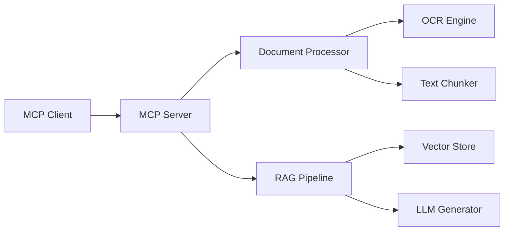

# 🎓 MCP Academic RAG Server

[](https://modelcontextprotocol.io)
[](https://python.org)
[](LICENSE)

**A focused MCP server for academic document processing and RAG queries**

Simple, reliable document processing with OCR and intelligent Q&A through the Model Context Protocol (MCP).

---

## 🎯 What It Does

This MCP server provides **4 essential tools** for document processing and retrieval:

1. **`process_document`** - Extract text from PDFs and images using OCR
2. **`query_documents`** - Ask questions about processed documents using RAG
3. **`get_document_info`** - View document metadata and processing status
4. **`list_sessions`** - Manage conversation sessions

**Perfect for**: Researchers, students, and anyone who needs to query academic papers and documents through AI assistants like Claude.

---

## ⚡ Quick Start (5 Minutes)

### 1. Install with uvx (Recommended)

```bash
# Install and run immediately
uvx mcp-academic-rag-server
```

### 2. Set API Key

```bash
# Create .env file
echo "OPENAI_API_KEY=your_api_key_here" > .env
```

### 3. Configure MCP Client

For **Claude Desktop**, add to `claude_desktop_config.json`:

```json
{
  "mcpServers": {
    "academic-rag": {
      "command": "uvx",
      "args": ["mcp-academic-rag-server"]
    }
  }
}
```

### 4. Start Using

```
👤 Process this research paper: /path/to/paper.pdf
🤖 [Document processed successfully with ID: doc_123]

👤 What are the main findings in this paper?
🤖 [Based on the document, the main findings are...]
```

**That's it!** Full setup guide: [SETUP_SIMPLIFIED.md](SETUP_SIMPLIFIED.md)

---

## 🛠️ Core Features

### Document Processing
- **PDF Text Extraction** - Direct text extraction from PDF files
- **OCR Processing** - Text recognition from scanned documents and images
- **Text Chunking** - Intelligent document segmentation for better retrieval
- **Embedding Generation** - Vector embeddings for semantic search

### RAG System
- **Semantic Search** - Find relevant document sections using vector similarity
- **Context-Aware Responses** - Generate answers with document context
- **Session Management** - Multi-turn conversations with memory
- **Source Attribution** - Cite specific document sections in responses

### MCP Integration
- **Standard Protocol** - Full MCP 1.0 compatibility
- **Tool Validation** - JSON Schema validation for all inputs
- **Error Handling** - Clear, actionable error messages
- **Async Support** - Non-blocking document processing

---

## 📋 System Requirements

- **Python**: 3.9 or higher
- **Memory**: 2GB RAM minimum (4GB recommended)
- **Storage**: 1GB free space
- **API Key**: OpenAI API key for embeddings and LLM

**Supported Document Types**:
- PDF files (text and scanned)
- Image files (PNG, JPG, TIFF)
- Text files (TXT, MD)

---

## 🔧 Configuration

The server works with **zero configuration** out of the box. Optional configuration via JSON:

```json
{
  "ocr": {
    "provider": "tesseract",
    "language": "eng"
  },
  "embeddings": {
    "model": "text-embedding-ada-002",
    "chunk_size": 1000,
    "chunk_overlap": 200
  },
  "llm": {
    "model": "gpt-3.5-turbo",
    "temperature": 0.1,
    "max_tokens": 500
  }
}
```

---

## 📖 Usage Examples

### Basic Document Processing

```python
# Through MCP client (Claude, etc.)
"Please process this document: /home/user/research.pdf"

# Response:
{
  "status": "success",
  "document_id": "doc_abc123",
  "pages_processed": 15,
  "text_extracted": true,
  "embeddings_generated": true
}
```

### Intelligent Querying

```python
# Ask questions about processed documents
"What methodology did the authors use for their experiments?"

# Get contextual answers with sources
{
  "answer": "The authors used a randomized controlled trial design...",
  "sources": [
    {"page": 5, "confidence": 0.95, "content": "...methodology section..."}
  ]
}
```

### Session Management

```python
# Multi-turn conversations
"What are the limitations mentioned in the study?"
"How do these limitations compare to previous work?"
"What future research directions do the authors suggest?"
```

---

## 🧪 Development & Testing

```bash
# Install for development
git clone https://github.com/yourusername/mcp-academic-rag-server.git
cd mcp-academic-rag-server
uvx --editable . mcp-academic-rag-server

# Run tests
pytest tests/

# Code formatting
black .
isort .
```

---

## 🔍 Architecture



**Simple & Focused**: Core functionality only, no over-engineering.

---

## 🚧 Roadmap

### ✅ Current (v1.0)
- 4 core MCP tools working
- Basic document processing
- Simple RAG functionality
- uvx package management

### 🔄 Next (v1.1)
- Enhanced error handling
- Performance optimizations
- Better OCR accuracy
- Configuration validation

### 🔮 Future (v1.2+)
- Additional document formats
- Simple web interface (optional)
- Plugin system for custom processors

**Principle**: Add features only when core functionality is rock-solid.

---

## 🤝 Contributing

We welcome contributions that align with our **core functionality focus**:

1. **Bug fixes** - Always welcome
2. **Core improvements** - Performance, reliability, accuracy
3. **Simple features** - That directly support the 4 main tools
4. **Documentation** - Clear, concise user guides

**Not accepting**: Enterprise features, complex monitoring, multi-tenant architecture, or other scope creep.

See [Contributing Guidelines](CONTRIBUTING.md) for details.

---

## 📄 License

MIT License - see [LICENSE](LICENSE) file.

---

## 🙏 Acknowledgments

Built with:
- [Model Context Protocol (MCP)](https://modelcontextprotocol.io) - AI assistant integration
- [Haystack](https://haystack.deepset.ai/) - RAG pipeline framework
- [OpenAI API](https://openai.com/api/) - Embeddings and language models
- [Tesseract OCR](https://github.com/tesseract-ocr/tesseract) - Text recognition

---

## 📞 Support

- **Issues**: [GitHub Issues](https://github.com/yourusername/mcp-academic-rag-server/issues)
- **Discussions**: [GitHub Discussions](https://github.com/yourusername/mcp-academic-rag-server/discussions)
- **Documentation**: [Setup Guide](SETUP_SIMPLIFIED.md) | [Roadmap](ROADMAP_REFOCUSED.md)

---

**Focus**: Getting basic MCP functionality right before adding complexity. 
**Goal**: 5-minute setup, reliable core features, excellent user experience.