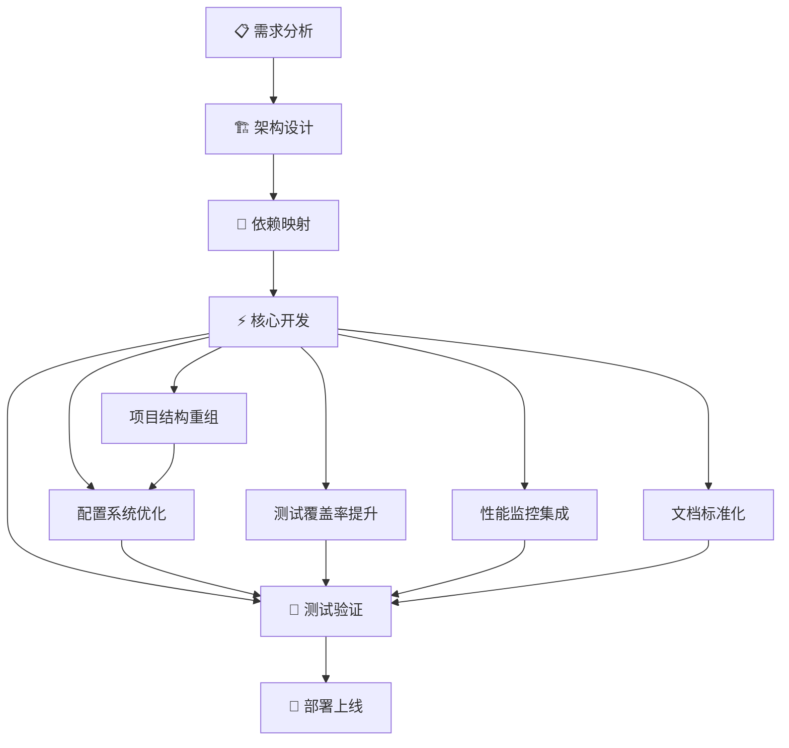

# 📊 MCP Academic RAG Server 重构项目 - 任务依赖关系图

## 🎯 项目全局视图



## 🔄 执行阶段分解

### 阶段 1: 项目结构重组 (高优先级, 顺序执行)
**依赖**: 无前置依赖  
**阻塞**: 配置系统优化、性能监控集成  
**并行**: 测试覆盖率提升、文档标准化

#### 关键任务:
1. **根目录文件整理** (2h)
   - 将31个Python文件减少到<10个
   - 移动MCP服务器到servers/目录
   - 创建分层架构目录

2. **模块重新组织** (4h)
   - 建立core/、services/、utils/分层
   - 优化import路径
   - 消除循环依赖

3. **验证和测试** (2h)
   - 确保所有导入正常工作
   - 运行现有测试确保无回归
   - 更新文档中的路径引用

### 阶段 2: 配置系统优化 (高优先级, 依赖阶段1)
**依赖**: 项目结构重组完成  
**阻塞**: 性能监控集成  
**并行**: 测试覆盖率提升、文档标准化

#### 关键任务:
1. **增强ConfigCenter功能** (3h)
   - 添加配置验证机制
   - 实现配置版本管理
   - 增强环境配置切换

2. **配置模式标准化** (2h)
   - 统一配置文件格式
   - 建立配置schema验证
   - 实现配置迁移工具

3. **集成测试** (1h)
   - 验证配置热更新功能
   - 测试多环境配置切换
   - 确保向后兼容性

### 阶段 3: 测试覆盖率提升 (高优先级, 可并行)
**依赖**: 无强依赖  
**阻塞**: 无  
**并行**: 结构重组、配置优化、文档标准化

#### 关键任务:
1. **单元测试扩展** (8h)
   - 核心业务逻辑测试
   - Mock和Stub标准化
   - 测试数据管理

2. **集成测试建设** (4h)
   - 端到端RAG流程测试
   - 多LLM提供商测试
   - 向量存储切换测试

3. **测试自动化** (3h)
   - CI/CD集成
   - 覆盖率报告生成
   - 失败重试机制

### 阶段 4: 性能监控集成 (中优先级, 依赖配置系统)
**依赖**: 配置系统优化完成  
**阻塞**: 无  
**并行**: 测试验证、文档标准化

#### 关键任务:
1. **APM系统集成** (4h)
   - OpenTelemetry集成
   - 分布式链路追踪
   - 业务指标监控

2. **日志系统统一** (2h)
   - 结构化日志格式
   - 敏感信息过滤
   - 日志收集集成

3. **健康检查完善** (2h)
   - 深度健康检查端点
   - 依赖服务监控
   - 自动恢复机制

### 阶段 5: 文档标准化 (中优先级, 可并行)
**依赖**: 无强依赖  
**阻塞**: 无  
**并行**: 所有其他阶段

#### 关键任务:
1. **文档结构重组** (3h)
   - 按照DOCUMENTATION_STRATEGY.md重组
   - 创建分层文档架构
   - 迁移现有文档

2. **API文档自动化** (4h)
   - OpenAPI规范生成
   - 交互式API文档
   - 代码示例自动生成

3. **内容质量提升** (3h)
   - 统一写作风格
   - 更新过时内容
   - 添加缺失文档

## 🚦 关键路径分析

### 主要关键路径:
```
项目结构重组 → 配置系统优化 → 性能监控集成 → 项目验证
```

### 次要关键路径:
```
测试覆盖率提升 → 项目验证
文档标准化 → 项目验证
```

## ⚡ 并行执行策略

### 第1-2周: 基础设施改进
- **主线**: 项目结构重组 (顺序执行)
- **并行**: 测试覆盖率提升、文档标准化开始

### 第3-4周: 系统增强
- **主线**: 配置系统优化 (依赖结构重组)
- **并行**: 测试覆盖率提升、文档标准化继续

### 第5-6周: 完善和验证
- **主线**: 性能监控集成
- **并行**: 所有阶段收尾和验证

## 🔍 风险点和缓解策略

### 高风险依赖:
1. **项目结构重组 → 配置系统优化**
   - **风险**: 结构变更可能影响配置路径
   - **缓解**: 先完成基础重组，保持配置路径稳定

2. **配置系统 → 监控系统**
   - **风险**: 监控配置依赖新的配置系统
   - **缓解**: 确保配置向后兼容，分阶段迁移

### 并行冲突风险:
1. **测试编写 vs 代码重构**
   - **风险**: 重构可能破坏并行编写的测试
   - **缓解**: 优先重构core模块，测试关注业务逻辑

2. **文档更新 vs 结构变更**
   - **风险**: 结构变更导致文档路径失效
   - **缓解**: 延迟路径相关文档更新到结构稳定后

## 📊 进度跟踪指标

### 阶段完成度:
- **结构重组**: 文件数量、导入路径、测试通过率
- **配置优化**: 配置覆盖率、验证通过率、热更新成功率
- **测试提升**: 代码覆盖率、测试用例数、CI通过率
- **监控集成**: 指标数量、告警规则、链路追踪覆盖
- **文档标准**: 文档覆盖率、链接有效性、用户反馈

### 质量门控:
- 每个阶段完成后必须通过质量验证
- 关键路径阶段完成度≥95%才能进入下一阶段
- 并行阶段可以在80%完成度时继续，但最终验证前必须100%

## 🎯 最终验证清单

- [ ] 项目结构符合企业级标准
- [ ] 配置系统功能完整且稳定
- [ ] 测试覆盖率达到80%+
- [ ] 性能监控完全集成
- [ ] 文档体系完整且准确
- [ ] 所有质量门控通过
- [ ] 向后兼容性保持
- [ ] 性能无显著退化

---

**创建时间**: 2025-08-15  
**负责人**: 项目重构团队  
**下次更新**: 每周五项目评审后更新