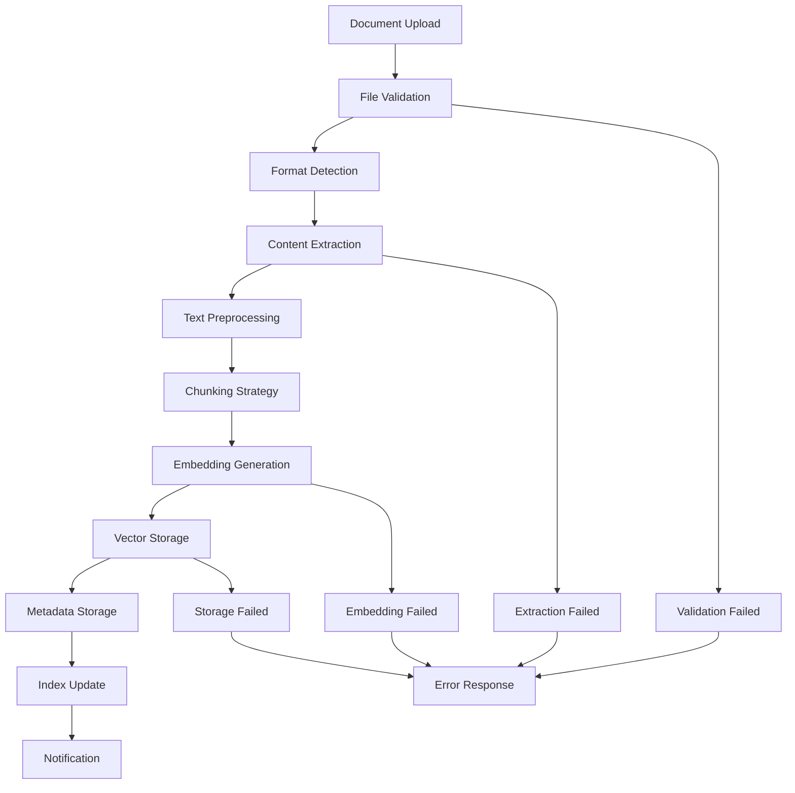
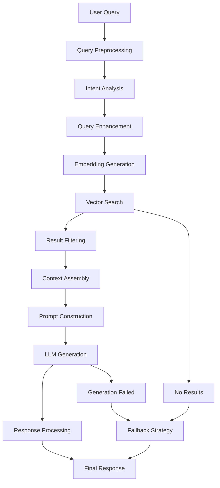
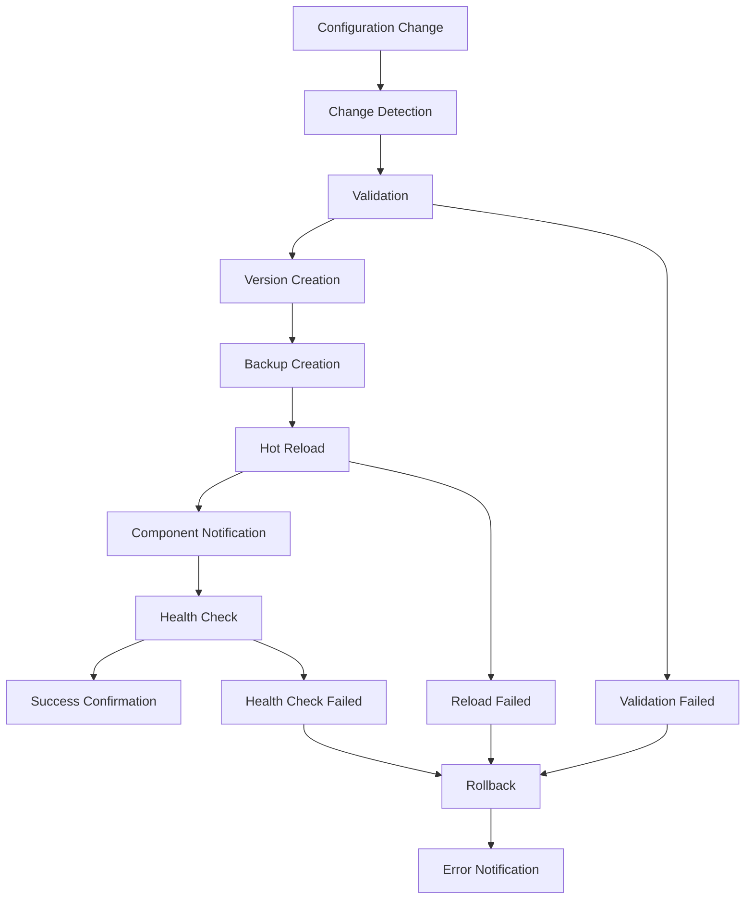

# MCP Academic RAG Server - Architecture Overview

Comprehensive architectural documentation for the MCP Academic RAG Server, covering system design, component interactions, data flow, and scalability considerations.

## Table of Contents

1. [System Architecture](#system-architecture)
2. [Core Components](#core-components)
3. [Data Flow and Processing](#data-flow-and-processing)
4. [Scalability and Performance](#scalability-and-performance)
5. [Security Architecture](#security-architecture)
6. [Integration Patterns](#integration-patterns)
7. [Deployment Architecture](#deployment-architecture)

## System Architecture

### High-Level Architecture

The MCP Academic RAG Server implements a layered, modular architecture designed for scalability, maintainability, and extensibility:

```
┌─────────────────────────────────────────────────────────────────┐
│                        Client Layer                             │
├─────────────────────────────────────────────────────────────────┤
│  ┌─────────────┐  ┌─────────────┐  ┌─────────────┐  ┌─────────┐ │
│  │ MCP Client  │  │ Web Client  │  │ API Client  │  │ Mobile  │ │
│  │ (Claude)    │  │ (React)     │  │ (Python)    │  │ App     │ │
│  └─────────────┘  └─────────────┘  └─────────────┘  └─────────┘ │
└─────────────────────────────────────────────────────────────────┘
                                 │
                    ┌─────────────┼─────────────┐
                    │                           │
┌─────────────────────────────────────────────────────────────────┐
│                      Gateway Layer                              │
├─────────────────────────────────────────────────────────────────┤
│  ┌─────────────┐  ┌─────────────┐  ┌─────────────┐              │
│  │ Load        │  │ API         │  │ WebSocket   │              │
│  │ Balancer    │  │ Gateway     │  │ Gateway     │              │
│  └─────────────┘  └─────────────┘  └─────────────┘              │
└─────────────────────────────────────────────────────────────────┘
                                 │
┌─────────────────────────────────────────────────────────────────┐
│                     Service Layer                               │
├─────────────────────────────────────────────────────────────────┤
│  ┌─────────────┐  ┌─────────────┐  ┌─────────────┐              │
│  │ MCP Server  │  │ REST API    │  │ WebSocket   │              │
│  │ (Core)      │  │ Server      │  │ Server      │              │
│  └─────────────┘  └─────────────┘  └─────────────┘              │
└─────────────────────────────────────────────────────────────────┘
                                 │
┌─────────────────────────────────────────────────────────────────┐
│                    Business Logic Layer                         │
├─────────────────────────────────────────────────────────────────┤
│  ┌─────────────┐  ┌─────────────┐  ┌─────────────┐              │
│  │ Document    │  │ RAG         │  │ Workflow    │              │
│  │ Processing  │  │ Engine      │  │ Engine      │              │
│  └─────────────┘  └─────────────┘  └─────────────┘              │
│                                                                 │
│  ┌─────────────┐  ┌─────────────┐  ┌─────────────┐              │
│  │ Config      │  │ Performance │  │ Security    │              │
│  │ Management  │  │ Monitor     │  │ Manager     │              │
│  └─────────────┘  └─────────────┘  └─────────────┘              │
└─────────────────────────────────────────────────────────────────┘
                                 │
┌─────────────────────────────────────────────────────────────────┐
│                      Data Access Layer                          │
├─────────────────────────────────────────────────────────────────┤
│  ┌─────────────┐  ┌─────────────┐  ┌─────────────┐              │
│  │ Vector      │  │ Document    │  │ Cache       │              │
│  │ Store       │  │ Store       │  │ Layer       │              │
│  └─────────────┘  └─────────────┘  └─────────────┘              │
└─────────────────────────────────────────────────────────────────┘
                                 │
┌─────────────────────────────────────────────────────────────────┐
│                     External Services                           │
├─────────────────────────────────────────────────────────────────┤
│  ┌─────────────┐  ┌─────────────┐  ┌─────────────┐              │
│  │ LLM         │  │ Embedding   │  │ External    │              │
│  │ Providers   │  │ Services    │  │ APIs        │              │
│  └─────────────┘  └─────────────┘  └─────────────┘              │
└─────────────────────────────────────────────────────────────────┘
```

### Component Architecture

The system is built using a microservices-inspired architecture with clear separation of concerns:

#### Core Services

1. **MCP Server**: Implements the Model Context Protocol for AI assistant integration
2. **Document Processor**: Handles document ingestion, parsing, and preprocessing
3. **RAG Engine**: Manages retrieval-augmented generation workflows
4. **Vector Store Manager**: Abstracts vector database operations
5. **Configuration Center**: Centralized configuration management with hot-reload
6. **Performance Monitor**: Real-time system monitoring and alerting
7. **Workflow Engine**: Orchestrates complex multi-step operations

#### Supporting Services

1. **Security Manager**: Authentication, authorization, and security policies
2. **Cache Manager**: Multi-level caching for performance optimization
3. **Plugin Manager**: Dynamic plugin loading and lifecycle management
4. **Telemetry Service**: Observability and distributed tracing
5. **Alert Manager**: Multi-channel alerting and notification system

## Core Components

### Document Processing Pipeline

```python
┌─────────────────────────────────────────────────────────────────┐
│                Document Processing Pipeline                     │
├─────────────────────────────────────────────────────────────────┤
│                                                                 │
│  Input Document                                                 │
│         │                                                       │
│         ▼                                                       │
│  ┌─────────────┐    ┌─────────────┐    ┌─────────────┐          │
│  │   File      │───▶│   Format    │───▶│  Content    │          │
│  │ Detection   │    │ Validation  │    │ Extraction  │          │
│  └─────────────┘    └─────────────┘    └─────────────┘          │
│         │                                      │                │
│         ▼                                      ▼                │
│  ┌─────────────┐    ┌─────────────┐    ┌─────────────┐          │
│  │   OCR       │    │    Text     │───▶│   Chunk     │          │
│  │ Processing  │───▶│ Preprocessing│    │ Generation  │          │
│  └─────────────┘    └─────────────┘    └─────────────┘          │
│         │                                      │                │
│         ▼                                      ▼                │
│  ┌─────────────┐    ┌─────────────┐    ┌─────────────┐          │
│  │  Metadata   │    │  Embedding  │───▶│   Vector    │          │
│  │ Extraction  │───▶│ Generation  │    │   Storage   │          │
│  └─────────────┘    └─────────────┘    └─────────────┘          │
│                                                                 │
└─────────────────────────────────────────────────────────────────┘
```

### RAG Query Processing

```python
┌─────────────────────────────────────────────────────────────────┐
│                   RAG Query Processing                          │
├─────────────────────────────────────────────────────────────────┤
│                                                                 │
│  User Query                                                     │
│      │                                                          │
│      ▼                                                          │
│  ┌─────────────┐    ┌─────────────┐    ┌─────────────┐          │
│  │   Query     │───▶│   Intent    │───▶│   Query     │          │
│  │ Processing  │    │ Detection   │    │ Enhancement │          │
│  └─────────────┘    └─────────────┘    └─────────────┘          │
│      │                                      │                  │
│      ▼                                      ▼                  │
│  ┌─────────────┐    ┌─────────────┐    ┌─────────────┐          │
│  │  Embedding  │───▶│   Vector    │───▶│   Context   │          │
│  │ Generation  │    │   Search    │    │ Aggregation │          │
│  └─────────────┘    └─────────────┘    └─────────────┘          │
│      │                                      │                  │
│      ▼                                      ▼                  │
│  ┌─────────────┐    ┌─────────────┐    ┌─────────────┐          │
│  │   Prompt    │───▶│     LLM     │───▶│  Response   │          │
│  │ Construction│    │ Generation  │    │ Processing  │          │
│  └─────────────┘    └─────────────┘    └─────────────┘          │
│                                                                 │
└─────────────────────────────────────────────────────────────────┘
```

### Configuration Management Architecture

```python
┌─────────────────────────────────────────────────────────────────┐
│              Configuration Management System                    │
├─────────────────────────────────────────────────────────────────┤
│                                                                 │
│  ┌─────────────────────────────────────────────────────────┐    │
│  │                Configuration Center                     │    │
│  │  ┌─────────────┐  ┌─────────────┐  ┌─────────────┐     │    │
│  │  │   Config    │  │   Version   │  │ Environment │     │    │
│  │  │   Loader    │  │  Manager    │  │   Manager   │     │    │
│  │  └─────────────┘  └─────────────┘  └─────────────┘     │    │
│  │                                                        │    │
│  │  ┌─────────────┐  ┌─────────────┐  ┌─────────────┐     │    │
│  │  │   Runtime   │  │  Migration  │  │   Change    │     │    │
│  │  │ Validator   │  │    Tool     │  │  Watcher    │     │    │
│  │  └─────────────┘  └─────────────┘  └─────────────┘     │    │
│  └─────────────────────────────────────────────────────────┘    │
│                              │                                  │
│  ┌─────────────────────────────────────────────────────────┐    │
│  │                File System Layer                        │    │
│  │                                                         │    │
│  │  config/                                               │    │
│  │  ├── config.json                                       │    │
│  │  ├── config.development.json                           │    │
│  │  ├── config.production.json                            │    │
│  │  ├── schemas/                                          │    │
│  │  │   ├── config.schema.json                            │    │
│  │  │   └── validation.rules.json                         │    │
│  │  └── versions/                                         │    │
│  │      ├── v1.0.0.json                                   │    │
│  │      └── v1.1.0.json                                   │    │
│  └─────────────────────────────────────────────────────────┘    │
│                                                                 │
└─────────────────────────────────────────────────────────────────┘
```

## Data Flow and Processing

### Document Ingestion Flow



### Query Processing Flow



### Configuration Update Flow



## Scalability and Performance

### Horizontal Scaling Architecture

```python
┌─────────────────────────────────────────────────────────────────┐
│                     Load Balancer                               │
│                    (HAProxy/Nginx)                              │
└─────────────────────┬───────────────────────────────────────────┘
                      │
    ┌─────────────────┼─────────────────┐
    │                 │                 │
┌───▼───┐        ┌───▼───┐        ┌───▼───┐
│ API   │        │ API   │        │ API   │
│Server │        │Server │        │Server │
│   1   │        │   2   │        │   N   │
└───┬───┘        └───┬───┘        └───┬───┘
    │                │                │
    └─────────────────┼─────────────────┘
                      │
┌─────────────────────▼─────────────────────────────────────────────┐
│                 Shared Services Layer                             │
├─────────────────────────────────────────────────────────────────┤
│  ┌─────────────┐  ┌─────────────┐  ┌─────────────┐              │
│  │   Vector    │  │ Document    │  │   Cache     │              │
│  │   Store     │  │   Store     │  │  (Redis)    │              │
│  │ (Replicated)│  │(PostgreSQL) │  │ (Cluster)   │              │
│  └─────────────┘  └─────────────┘  └─────────────┘              │
└─────────────────────────────────────────────────────────────────┘
```

### Performance Optimization Strategies

#### 1. Caching Architecture

```python
┌─────────────────────────────────────────────────────────────────┐
│                   Multi-Level Caching                           │
├─────────────────────────────────────────────────────────────────┤
│                                                                 │
│  Level 1: Application Cache (In-Memory)                        │
│  ┌─────────────┐  ┌─────────────┐  ┌─────────────┐             │
│  │   Query     │  │ Embedding   │  │ Configuration│             │
│  │  Results    │  │   Cache     │  │    Cache     │             │
│  └─────────────┘  └─────────────┘  └─────────────┘             │
│                                                                 │
│  Level 2: Distributed Cache (Redis)                            │
│  ┌─────────────┐  ┌─────────────┐  ┌─────────────┐             │
│  │   Vector    │  │  Document   │  │   Session   │             │
│  │  Indexes    │  │  Metadata   │  │    Data     │             │
│  └─────────────┘  └─────────────┘  └─────────────┘             │
│                                                                 │
│  Level 3: Persistent Cache (SSD)                              │
│  ┌─────────────┐  ┌─────────────┐  ┌─────────────┐             │
│  │  Large      │  │ Processed   │  │   Archive   │             │
│  │ Embeddings  │  │ Documents   │  │    Data     │             │
│  └─────────────┘  └─────────────┘  └─────────────┘             │
│                                                                 │
└─────────────────────────────────────────────────────────────────┘
```

#### 2. Asynchronous Processing

```python
import asyncio
from concurrent.futures import ThreadPoolExecutor
from typing import List, Coroutine, Any

class AsyncProcessingEngine:
    """High-performance async processing engine."""
    
    def __init__(self, max_workers: int = 8, max_concurrent: int = 100):
        self.thread_pool = ThreadPoolExecutor(max_workers=max_workers)
        self.semaphore = asyncio.Semaphore(max_concurrent)
    
    async def process_documents_parallel(self, documents: List[Document]) -> List[ProcessResult]:
        """Process documents with controlled concurrency."""
        
        async def process_with_semaphore(doc: Document) -> ProcessResult:
            async with self.semaphore:
                # CPU-bound operations in thread pool
                loop = asyncio.get_event_loop()
                return await loop.run_in_executor(
                    self.thread_pool, 
                    self._process_document_sync, 
                    doc
                )
        
        # Process all documents concurrently
        tasks = [process_with_semaphore(doc) for doc in documents]
        results = await asyncio.gather(*tasks, return_exceptions=True)
        
        # Handle exceptions
        processed_results = []
        for result in results:
            if isinstance(result, Exception):
                processed_results.append(ProcessResult(
                    success=False,
                    error=result
                ))
            else:
                processed_results.append(result)
        
        return processed_results
```

#### 3. Vector Index Optimization

```python
class OptimizedVectorStore:
    """Optimized vector store with performance tuning."""
    
    def __init__(self, config: Dict[str, Any]):
        self.config = config
        self.dimension = config['dimension']
        self.use_gpu = config.get('use_gpu', False)
        
        # Initialize optimized index
        self._create_optimized_index()
    
    def _create_optimized_index(self):
        """Create performance-optimized FAISS index."""
        import faiss
        
        # Choose index type based on data size and performance requirements
        expected_size = self.config.get('expected_documents', 100000)
        
        if expected_size < 10000:
            # Small dataset - use flat index for accuracy
            if self.use_gpu:
                self.index = faiss.IndexFlatIP(self.dimension)
                self.index = faiss.index_cpu_to_gpu(faiss.StandardGpuResources(), 0, self.index)
            else:
                self.index = faiss.IndexFlatIP(self.dimension)
        
        elif expected_size < 1000000:
            # Medium dataset - use IVF with optimal nlist
            nlist = min(4096, max(64, int(np.sqrt(expected_size))))
            quantizer = faiss.IndexFlatIP(self.dimension)
            
            if self.use_gpu:
                self.index = faiss.IndexIVFFlat(quantizer, self.dimension, nlist)
                self.index = faiss.index_cpu_to_gpu(faiss.StandardGpuResources(), 0, self.index)
            else:
                self.index = faiss.IndexIVFFlat(quantizer, self.dimension, nlist)
            
            # Optimize search parameters
            self.index.nprobe = min(nlist // 4, 128)
        
        else:
            # Large dataset - use HNSW for speed
            self.index = faiss.IndexHNSWFlat(self.dimension, 32)
            self.index.hnsw.efConstruction = 200
            self.index.hnsw.efSearch = 50
```

## Security Architecture

### Authentication and Authorization

```python
┌─────────────────────────────────────────────────────────────────┐
│                 Security Architecture                           │
├─────────────────────────────────────────────────────────────────┤
│                                                                 │
│  ┌─────────────────────────────────────────────────────────┐    │
│  │              Authentication Layer                       │    │
│  │                                                         │    │
│  │  ┌─────────────┐  ┌─────────────┐  ┌─────────────┐     │    │
│  │  │   API Key   │  │    JWT      │  │   OAuth     │     │    │
│  │  │    Auth     │  │    Auth     │  │    2.0      │     │    │
│  │  └─────────────┘  └─────────────┘  └─────────────┘     │    │
│  └─────────────────────────────────────────────────────────┘    │
│                              │                                  │
│  ┌─────────────────────────────────────────────────────────┐    │
│  │              Authorization Layer                        │    │
│  │                                                         │    │
│  │  ┌─────────────┐  ┌─────────────┐  ┌─────────────┐     │    │
│  │  │    RBAC     │  │   Policy    │  │   Rate      │     │    │
│  │  │   Engine    │  │  Engine     │  │ Limiting    │     │    │
│  │  └─────────────┘  └─────────────┘  └─────────────┘     │    │
│  └─────────────────────────────────────────────────────────┘    │
│                              │                                  │
│  ┌─────────────────────────────────────────────────────────┐    │
│  │                Security Controls                        │    │
│  │                                                         │    │
│  │  ┌─────────────┐  ┌─────────────┐  ┌─────────────┐     │    │
│  │  │   Input     │  │   Output    │  │   Audit     │     │    │
│  │  │ Validation  │  │ Sanitization│  │  Logging    │     │    │
│  │  └─────────────┘  └─────────────┘  └─────────────┘     │    │
│  └─────────────────────────────────────────────────────────┘    │
│                                                                 │
└─────────────────────────────────────────────────────────────────┘
```

### Data Protection

```python
class SecurityManager:
    """Comprehensive security management system."""
    
    def __init__(self, config: Dict[str, Any]):
        self.config = config
        self.encryption_key = self._load_encryption_key()
        self.auth_providers = self._initialize_auth_providers()
        self.rate_limiters = self._initialize_rate_limiters()
    
    async def authenticate_request(self, request: Any) -> Optional[User]:
        """Authenticate incoming request."""
        auth_header = request.headers.get('Authorization')
        if not auth_header:
            raise UnauthorizedException("Missing authentication")
        
        auth_type, token = auth_header.split(' ', 1)
        
        if auth_type.lower() == 'bearer':
            return await self._validate_bearer_token(token)
        elif auth_type.lower() == 'api-key':
            return await self._validate_api_key(token)
        else:
            raise UnauthorizedException("Unsupported authentication type")
    
    async def authorize_action(self, user: User, action: str, resource: str) -> bool:
        """Authorize user action on resource."""
        # Check RBAC permissions
        if not self._check_rbac_permission(user, action, resource):
            return False
        
        # Check rate limits
        if not await self._check_rate_limit(user, action):
            return False
        
        # Check policy constraints
        if not await self._check_policy_constraints(user, action, resource):
            return False
        
        return True
    
    def encrypt_sensitive_data(self, data: str) -> str:
        """Encrypt sensitive data for storage."""
        from cryptography.fernet import Fernet
        
        fernet = Fernet(self.encryption_key)
        encrypted_data = fernet.encrypt(data.encode())
        return encrypted_data.decode()
    
    def decrypt_sensitive_data(self, encrypted_data: str) -> str:
        """Decrypt sensitive data from storage."""
        from cryptography.fernet import Fernet
        
        fernet = Fernet(self.encryption_key)
        decrypted_data = fernet.decrypt(encrypted_data.encode())
        return decrypted_data.decode()
```

## Integration Patterns

### MCP Protocol Integration

```python
from mcp.server import Server
from mcp.types import Tool, TextContent, ImageContent
from typing import List, Dict, Any

class MCPServerIntegration:
    """Enhanced MCP server with comprehensive tool support."""
    
    def __init__(self, config: Dict[str, Any]):
        self.config = config
        self.server = Server("academic-rag-server")
        self.setup_tools()
    
    def setup_tools(self):
        """Setup comprehensive MCP tools."""
        
        @self.server.list_tools()
        async def handle_list_tools() -> List[Tool]:
            """Return available MCP tools."""
            return [
                Tool(
                    name="process_document",
                    description="Process academic documents with OCR and text extraction",
                    inputSchema={
                        "type": "object",
                        "properties": {
                            "file_path": {"type": "string", "description": "Path to document file"},
                            "file_name": {"type": "string", "description": "Document filename"},
                            "metadata": {"type": "object", "description": "Optional metadata"}
                        },
                        "required": ["file_path"]
                    }
                ),
                Tool(
                    name="query_documents",
                    description="Query processed documents using RAG",
                    inputSchema={
                        "type": "object",
                        "properties": {
                            "query": {"type": "string", "description": "Query text"},
                            "collection_id": {"type": "string", "description": "Optional collection filter"},
                            "top_k": {"type": "integer", "description": "Number of results", "default": 5},
                            "include_sources": {"type": "boolean", "description": "Include source references", "default": True}
                        },
                        "required": ["query"]
                    }
                ),
                Tool(
                    name="create_collection",
                    description="Create a new document collection",
                    inputSchema={
                        "type": "object",
                        "properties": {
                            "name": {"type": "string", "description": "Collection name"},
                            "description": {"type": "string", "description": "Collection description"},
                            "metadata": {"type": "object", "description": "Collection metadata"}
                        },
                        "required": ["name"]
                    }
                ),
                Tool(
                    name="analyze_document",
                    description="Perform advanced document analysis",
                    inputSchema={
                        "type": "object",
                        "properties": {
                            "document_id": {"type": "string", "description": "Document identifier"},
                            "analysis_type": {"type": "string", "enum": ["summary", "keywords", "topics", "sentiment"]},
                            "options": {"type": "object", "description": "Analysis options"}
                        },
                        "required": ["document_id", "analysis_type"]
                    }
                )
            ]
        
        @self.server.call_tool()
        async def handle_call_tool(name: str, arguments: Dict[str, Any]) -> List[TextContent]:
            """Handle MCP tool invocations."""
            try:
                if name == "process_document":
                    return await self._process_document_tool(arguments)
                elif name == "query_documents":
                    return await self._query_documents_tool(arguments)
                elif name == "create_collection":
                    return await self._create_collection_tool(arguments)
                elif name == "analyze_document":
                    return await self._analyze_document_tool(arguments)
                else:
                    raise ValueError(f"Unknown tool: {name}")
            
            except Exception as e:
                return [TextContent(
                    type="text",
                    text=json.dumps({
                        "status": "error",
                        "message": str(e),
                        "tool": name
                    })
                )]
```

## Deployment Architecture

### Production Deployment Patterns

#### 1. Single Server Deployment

```yaml
# docker-compose.prod.yml
version: '3.8'

services:
  mcp-rag-server:
    image: mcp/academic-rag-server:latest
    ports:
      - "8080:8080"
    environment:
      - CONFIG_PATH=/app/config/production.json
      - LOG_LEVEL=INFO
    volumes:
      - ./config:/app/config
      - ./data:/app/data
      - ./logs:/app/logs
    restart: unless-stopped
    healthcheck:
      test: ["CMD", "curl", "-f", "http://localhost:8080/health"]
      interval: 30s
      timeout: 10s
      retries: 3
    deploy:
      resources:
        limits:
          cpus: '2.0'
          memory: 4G
        reservations:
          cpus: '1.0'
          memory: 2G
```

#### 2. High Availability Deployment

```yaml
# k8s/deployment.yaml
apiVersion: apps/v1
kind: Deployment
metadata:
  name: mcp-rag-server
spec:
  replicas: 3
  selector:
    matchLabels:
      app: mcp-rag-server
  template:
    metadata:
      labels:
        app: mcp-rag-server
    spec:
      containers:
      - name: mcp-rag-server
        image: mcp/academic-rag-server:latest
        ports:
        - containerPort: 8080
        env:
        - name: CONFIG_PATH
          value: "/app/config/production.json"
        resources:
          requests:
            memory: "2Gi"
            cpu: "1000m"
          limits:
            memory: "4Gi"
            cpu: "2000m"
        livenessProbe:
          httpGet:
            path: /health
            port: 8080
          initialDelaySeconds: 60
          periodSeconds: 30
        readinessProbe:
          httpGet:
            path: /ready
            port: 8080
          initialDelaySeconds: 30
          periodSeconds: 10
---
apiVersion: v1
kind: Service
metadata:
  name: mcp-rag-server-service
spec:
  selector:
    app: mcp-rag-server
  ports:
  - protocol: TCP
    port: 80
    targetPort: 8080
  type: LoadBalancer
```

This architecture overview provides a comprehensive understanding of the MCP Academic RAG Server's design, helping developers and operators understand the system's structure, data flow, and deployment patterns for successful implementation and maintenance.