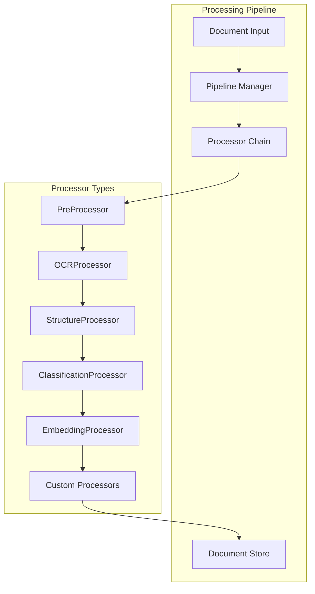

# 🛠️ Developer Guide: Extending Processors

A comprehensive guide for extending the MCP Academic RAG Server with custom processors, integrations, and advanced functionality.

## Table of Contents

- [Architecture Overview](#architecture-overview)
- [Creating Custom Processors](#creating-custom-processors)
- [Async Processing Patterns](#async-processing-patterns)
- [Integration Examples](#integration-examples)
- [Testing Custom Processors](#testing-custom-processors)
- [Performance Optimization](#performance-optimization)
- [Deployment Strategies](#deployment-strategies)

---

## Architecture Overview

### Core Components



### Base Processor Interface

```python
from abc import ABC, abstractmethod
from typing import Dict, Any, Optional, List
import asyncio
from models.document import Document
from models.process_result import ProcessResult

class IProcessor(ABC):
    """Base interface for all processors"""
    
    def __init__(self, config: Dict[str, Any] = None):
        self.config = config or {}
        self.name = self.__class__.__name__
        self.enabled = self.config.get('enabled', True)
        self.async_enabled = self.config.get('async_enabled', True)
    
    @abstractmethod
    def process(self, document: Document) -> ProcessResult:
        """Synchronous processing method"""
        pass
    
    async def process_async(self, document: Document) -> ProcessResult:
        """Asynchronous processing method"""
        if hasattr(self, '_process_async_impl'):
            return await self._process_async_impl(document)
        else:
            # Fallback to sync processing in thread pool
            loop = asyncio.get_event_loop()
            return await loop.run_in_executor(None, self.process, document)
    
    def validate_config(self) -> bool:
        """Validate processor configuration"""
        return True
    
    def get_dependencies(self) -> List[str]:
        """Return list of required processor dependencies"""
        return []
    
    def cleanup(self):
        """Cleanup resources"""
        pass
```

---

## Creating Custom Processors

### Example 1: Language Detection Processor

```python
from processors.base_processor import IProcessor
from models.document import Document
from models.process_result import ProcessResult
import langdetect
from typing import Dict, Any

class LanguageDetectionProcessor(IProcessor):
    """Detects document language using langdetect library"""
    
    def __init__(self, config: Dict[str, Any] = None):
        super().__init__(config)
        self.supported_languages = self.config.get('supported_languages', 
            ['en', 'zh', 'es', 'fr', 'de', 'ja', 'ko'])
        self.confidence_threshold = self.config.get('confidence_threshold', 0.8)
    
    def process(self, document: Document) -> ProcessResult:
        """Detect document language"""
        try:
            # Get text content from previous processing stages
            text_content = document.get_content('ocr') or document.get_content('raw_text')
            
            if not text_content:
                return ProcessResult.error_result(
                    "No text content available for language detection",
                    ValueError("Missing text content")
                )
            
            # Detect language
            detected_lang = langdetect.detect(text_content)
            confidence = self._calculate_confidence(text_content, detected_lang)
            
            # Store results
            language_info = {
                'detected_language': detected_lang,
                'confidence': confidence,
                'supported': detected_lang in self.supported_languages,
                'alternatives': self._get_alternatives(text_content)
            }
            
            document.store_content('language_detection', language_info)
            document.add_metadata('language', detected_lang)
            document.add_metadata('language_confidence', confidence)
            
            return ProcessResult.success_result(
                f"Language detected: {detected_lang} (confidence: {confidence:.2f})"
            )
            
        except Exception as e:
            return ProcessResult.error_result(
                f"Language detection failed: {str(e)}", e
            )
    
    async def _process_async_impl(self, document: Document) -> ProcessResult:
        """Async implementation with better performance"""
        loop = asyncio.get_event_loop()
        
        # Run CPU-intensive detection in thread pool
        result = await loop.run_in_executor(None, self.process, document)
        return result
    
    def _calculate_confidence(self, text: str, detected_lang: str) -> float:
        """Calculate confidence score for detected language"""
        try:
            from langdetect.lang_detect_exception import LangDetectException
            import langdetect
            
            # Use langdetect's internal confidence calculation
            detector = langdetect.DetectorFactory.create()
            detector.append(text)
            probabilities = detector.get_probabilities()
            
            for prob in probabilities:
                if prob.lang == detected_lang:
                    return prob.prob
            
            return 0.5  # Default confidence
        except:
            return 0.5
    
    def _get_alternatives(self, text: str) -> List[Dict[str, Any]]:
        """Get alternative language detections"""
        try:
            detector = langdetect.DetectorFactory.create()
            detector.append(text)
            probabilities = detector.get_probabilities()
            
            return [
                {'language': prob.lang, 'confidence': prob.prob}
                for prob in probabilities[:3]  # Top 3 alternatives
            ]
        except:
            return []
    
    def validate_config(self) -> bool:
        """Validate configuration"""
        if not isinstance(self.supported_languages, list):
            return False
        if not 0 <= self.confidence_threshold <= 1:
            return False
        return True
```

### Example 2: Citation Extraction Processor

```python
import re
from typing import List, Dict, Any
from processors.base_processor import IProcessor
from models.document import Document  
from models.process_result import ProcessResult

class CitationExtractionProcessor(IProcessor):
    """Extracts academic citations from documents"""
    
    def __init__(self, config: Dict[str, Any] = None):
        super().__init__(config)
        self.citation_styles = self.config.get('citation_styles', ['apa', 'ieee', 'mla'])
        self.extract_doi = self.config.get('extract_doi', True)
        self.extract_urls = self.config.get('extract_urls', True)
        
        # Regex patterns for different citation formats
        self.patterns = {
            'doi': r'10\.\d{4,}\/[^\s]+',
            'arxiv': r'arXiv:\d{4}\.\d{4,5}',
            'isbn': r'ISBN[-\s]?(?:\d{1,5}[-\s]?\d{1,7}[-\s]?\d{1,6}[-\s]?[\dX])',
            'url': r'https?://[^\s<>"{}|\\^`\[\]]+',
            'year': r'\b(19|20)\d{2}\b',
            'author_year': r'([A-Z][a-z]+(?:\s+[A-Z][a-z]+)*)\s*\((\d{4})\)'
        }
    
    def process(self, document: Document) -> ProcessResult:
        """Extract citations from document"""
        try:
            # Get text content
            text_content = document.get_content('ocr') or document.get_content('structure')
            
            if not text_content:
                return ProcessResult.error_result(
                    "No text content available for citation extraction",
                    ValueError("Missing text content")
                )
            
            # Extract different types of citations
            citations = {
                'references': self._extract_references(text_content),
                'dois': self._extract_dois(text_content) if self.extract_doi else [],
                'urls': self._extract_urls(text_content) if self.extract_urls else [],
                'in_text_citations': self._extract_in_text_citations(text_content),
                'bibliography': self._extract_bibliography(text_content)
            }
            
            # Store results
            document.store_content('citations', citations)
            document.add_metadata('citation_count', len(citations['references']))
            document.add_metadata('doi_count', len(citations['dois']))
            
            total_citations = sum(len(v) if isinstance(v, list) else 0 
                                for v in citations.values())
            
            return ProcessResult.success_result(
                f"Extracted {total_citations} citations and references"
            )
            
        except Exception as e:
            return ProcessResult.error_result(
                f"Citation extraction failed: {str(e)}", e
            )
    
    def _extract_references(self, text: str) -> List[Dict[str, Any]]:
        """Extract formatted references"""
        references = []
        
        # Look for references section
        ref_section_pattern = r'(?i)(?:references|bibliography|works\s+cited)\s*\n(.*?)(?=\n\s*\n|\Z)'
        ref_match = re.search(ref_section_pattern, text, re.DOTALL)
        
        if ref_match:
            ref_text = ref_match.group(1)
            
            # Split into individual references (numbered or bulleted)
            ref_pattern = r'(?:\n|\A)\s*(?:\[\d+\]|\d+\.|\•)\s*(.+?)(?=\n\s*(?:\[\d+\]|\d+\.|\•)|\Z)'
            refs = re.findall(ref_pattern, ref_text, re.DOTALL)
            
            for i, ref in enumerate(refs):
                parsed_ref = self._parse_reference(ref.strip())
                parsed_ref['index'] = i + 1
                references.append(parsed_ref)
        
        return references
    
    def _parse_reference(self, ref_text: str) -> Dict[str, Any]:
        """Parse individual reference into components"""
        reference = {
            'raw_text': ref_text,
            'authors': [],
            'title': None,
            'year': None,
            'journal': None,
            'doi': None,
            'url': None
        }
        
        # Extract DOI
        doi_match = re.search(self.patterns['doi'], ref_text)
        if doi_match:
            reference['doi'] = doi_match.group()
        
        # Extract URL
        url_match = re.search(self.patterns['url'], ref_text)
        if url_match:
            reference['url'] = url_match.group()
        
        # Extract year
        year_match = re.search(self.patterns['year'], ref_text)
        if year_match:
            reference['year'] = int(year_match.group())
        
        # Extract authors (simple heuristic)
        author_pattern = r'^([^.]+?)(?:\s*\(\d{4}\)|\.)'
        author_match = re.search(author_pattern, ref_text)
        if author_match:
            authors_text = author_match.group(1)
            # Split on 'and', '&', or commas
            authors = re.split(r'\s+and\s+|\s*&\s*|,\s*', authors_text)
            reference['authors'] = [author.strip() for author in authors if author.strip()]
        
        # Extract title (heuristic: text in quotes or after authors before year)
        title_pattern = r'["\'](.*?)["\']|(?:authors.*?)\s+([^.]+?)\.?\s*(?:\(\d{4}\)|$)'
        title_match = re.search(title_pattern, ref_text)
        if title_match:
            reference['title'] = title_match.group(1) or title_match.group(2)
        
        return reference
    
    def _extract_dois(self, text: str) -> List[str]:
        """Extract DOI identifiers"""
        return re.findall(self.patterns['doi'], text)
    
    def _extract_urls(self, text: str) -> List[str]:
        """Extract URLs"""
        return re.findall(self.patterns['url'], text)
    
    def _extract_in_text_citations(self, text: str) -> List[Dict[str, Any]]:
        """Extract in-text citations like (Author, 2023)"""
        citations = []
        
        # Pattern for (Author, Year) format
        pattern = r'\(([^()]+),\s*(\d{4})\)'
        matches = re.finditer(pattern, text)
        
        for match in matches:
            citations.append({
                'author': match.group(1).strip(),
                'year': int(match.group(2)),
                'position': match.start(),
                'text': match.group(0)
            })
        
        return citations
    
    def _extract_bibliography(self, text: str) -> Dict[str, Any]:
        """Extract bibliography metadata"""
        return {
            'has_bibliography': bool(re.search(r'(?i)(?:references|bibliography)', text)),
            'reference_count': len(self._extract_references(text)),
            'doi_count': len(self._extract_dois(text)),
            'url_count': len(self._extract_urls(text))
        }
    
    def get_dependencies(self) -> List[str]:
        """Citation extraction depends on OCR or structure processing"""
        return ['OCRProcessor', 'StructureProcessor']
```

### Example 3: Custom Knowledge Graph Processor

```python
import spacy
import networkx as nx
from typing import Dict, Any, List, Tuple
from processors.base_processor import IProcessor
from models.document import Document
from models.process_result import ProcessResult

class AdvancedKnowledgeGraphProcessor(IProcessor):
    """Advanced knowledge graph extraction with entity relationships"""
    
    def __init__(self, config: Dict[str, Any] = None):
        super().__init__(config)
        self.model_name = self.config.get('spacy_model', 'en_core_web_sm')
        self.entity_types = self.config.get('entity_types', 
            ['PERSON', 'ORG', 'GPE', 'MONEY', 'DATE', 'CARDINAL'])
        self.min_entity_freq = self.config.get('min_entity_frequency', 2)
        self.extract_relations = self.config.get('extract_relations', True)
        
        # Load spaCy model
        try:
            self.nlp = spacy.load(self.model_name)
        except OSError:
            raise ValueError(f"spaCy model '{self.model_name}' not found. "
                           f"Install with: python -m spacy download {self.model_name}")
    
    def process(self, document: Document) -> ProcessResult:
        """Extract knowledge graph from document"""
        try:
            # Get processed text
            text_content = document.get_content('ocr') or document.get_content('structure')
            
            if not text_content:
                return ProcessResult.error_result(
                    "No text content available for knowledge graph extraction",
                    ValueError("Missing text content")
                )
            
            # Process text with spaCy
            doc = self.nlp(text_content)
            
            # Extract entities
            entities = self._extract_entities(doc)
            
            # Extract relationships
            relationships = []
            if self.extract_relations:
                relationships = self._extract_relationships(doc, entities)
            
            # Build knowledge graph
            graph = self._build_knowledge_graph(entities, relationships)
            
            # Calculate graph metrics
            metrics = self._calculate_graph_metrics(graph)
            
            # Store results
            kg_data = {
                'entities': entities,
                'relationships': relationships,
                'graph_metrics': metrics,
                'entity_count': len(entities),
                'relationship_count': len(relationships)
            }
            
            document.store_content('knowledge_graph', kg_data)
            document.add_metadata('entity_count', len(entities))
            document.add_metadata('relationship_count', len(relationships))
            
            return ProcessResult.success_result(
                f"Extracted knowledge graph with {len(entities)} entities "
                f"and {len(relationships)} relationships"
            )
            
        except Exception as e:
            return ProcessResult.error_result(
                f"Knowledge graph extraction failed: {str(e)}", e
            )
    
    def _extract_entities(self, doc) -> List[Dict[str, Any]]:
        """Extract named entities with metadata"""
        entities = {}
        
        for ent in doc.ents:
            if ent.label_ in self.entity_types:
                entity_text = ent.text.strip()
                
                if entity_text not in entities:
                    entities[entity_text] = {
                        'text': entity_text,
                        'label': ent.label_,
                        'description': spacy.explain(ent.label_),
                        'frequency': 0,
                        'positions': [],
                        'confidence': 0.0
                    }
                
                entities[entity_text]['frequency'] += 1
                entities[entity_text]['positions'].append({
                    'start': ent.start_char,
                    'end': ent.end_char,
                    'sentence_id': self._get_sentence_id(doc, ent.start)
                })
        
        # Filter by minimum frequency and calculate confidence
        filtered_entities = []
        for entity_data in entities.values():
            if entity_data['frequency'] >= self.min_entity_freq:
                # Simple confidence based on frequency and length
                entity_data['confidence'] = min(
                    entity_data['frequency'] / 10.0 + len(entity_data['text']) / 50.0,
                    1.0
                )
                filtered_entities.append(entity_data)
        
        return sorted(filtered_entities, key=lambda x: x['confidence'], reverse=True)
    
    def _extract_relationships(self, doc, entities: List[Dict[str, Any]]) -> List[Dict[str, Any]]:
        """Extract relationships between entities"""
        relationships = []
        entity_texts = {ent['text']: ent for ent in entities}
        
        for sent in doc.sents:
            sent_entities = []
            
            # Find entities in this sentence
            for ent in sent.ents:
                if ent.text.strip() in entity_texts:
                    sent_entities.append({
                        'text': ent.text.strip(),
                        'start': ent.start,
                        'end': ent.end,
                        'token': ent
                    })
            
            # Extract relationships between entities in the same sentence
            for i, ent1 in enumerate(sent_entities):
                for ent2 in sent_entities[i+1:]:
                    relationship = self._find_relationship(sent, ent1, ent2)
                    if relationship:
                        relationships.append(relationship)
        
        return relationships
    
    def _find_relationship(self, sentence, ent1: Dict, ent2: Dict) -> Dict[str, Any]:
        """Find relationship between two entities in a sentence"""
        # Simple dependency parsing approach
        tokens_between = []
        start_idx = min(ent1['end'], ent2['end'])
        end_idx = max(ent1['start'], ent2['start'])
        
        for token in sentence[start_idx:end_idx]:
            if token.dep_ in ['ROOT', 'aux', 'cop', 'nsubj', 'dobj', 'prep']:
                tokens_between.append(token.lemma_)
        
        if tokens_between:
            relationship_type = self._classify_relationship(tokens_between)
            return {
                'subject': ent1['text'],
                'object': ent2['text'],
                'predicate': ' '.join(tokens_between),
                'type': relationship_type,
                'sentence': sentence.text,
                'confidence': 0.7  # Simple confidence score
            }
        
        return None
    
    def _classify_relationship(self, tokens: List[str]) -> str:
        """Classify relationship type based on tokens"""
        relationship_patterns = {
            'is_a': ['is', 'are', 'was', 'were', 'be'],
            'has': ['has', 'have', 'had', 'possess', 'own'],
            'located_in': ['in', 'at', 'on', 'within', 'inside'],
            'works_for': ['work', 'employed', 'job', 'position'],
            'created_by': ['create', 'develop', 'invent', 'design'],
            'part_of': ['part', 'component', 'element', 'section']
        }
        
        for rel_type, patterns in relationship_patterns.items():
            if any(token in patterns for token in tokens):
                return rel_type
        
        return 'related_to'
    
    def _build_knowledge_graph(self, entities: List[Dict], relationships: List[Dict]) -> nx.Graph:
        """Build NetworkX graph from entities and relationships"""
        G = nx.Graph()
        
        # Add entity nodes
        for entity in entities:
            G.add_node(
                entity['text'],
                label=entity['label'],
                frequency=entity['frequency'],
                confidence=entity['confidence']
            )
        
        # Add relationship edges
        for rel in relationships:
            if G.has_node(rel['subject']) and G.has_node(rel['object']):
                G.add_edge(
                    rel['subject'],
                    rel['object'],
                    type=rel['type'],
                    predicate=rel['predicate'],
                    confidence=rel['confidence']
                )
        
        return G
    
    def _calculate_graph_metrics(self, graph: nx.Graph) -> Dict[str, Any]:
        """Calculate graph topology metrics"""
        if len(graph.nodes()) == 0:
            return {'nodes': 0, 'edges': 0}
        
        metrics = {
            'nodes': len(graph.nodes()),
            'edges': len(graph.edges()),
            'density': nx.density(graph),
            'connected_components': nx.number_connected_components(graph)
        }
        
        if len(graph.nodes()) > 1:
            # Calculate centrality measures
            degree_centrality = nx.degree_centrality(graph)
            betweenness_centrality = nx.betweenness_centrality(graph)
            
            metrics.update({
                'most_central_entity': max(degree_centrality, key=degree_centrality.get),
                'avg_degree_centrality': sum(degree_centrality.values()) / len(degree_centrality),
                'most_connecting_entity': max(betweenness_centrality, key=betweenness_centrality.get)
            })
        
        return metrics
    
    def _get_sentence_id(self, doc, token_start: int) -> int:
        """Get sentence ID for a token position"""
        for i, sent in enumerate(doc.sents):
            if sent.start <= token_start < sent.end:
                return i
        return -1
    
    async def _process_async_impl(self, document: Document) -> ProcessResult:
        """Async implementation for better performance"""
        # spaCy processing can be CPU intensive
        loop = asyncio.get_event_loop()
        return await loop.run_in_executor(None, self.process, document)
    
    def get_dependencies(self) -> List[str]:
        """Depends on text extraction"""
        return ['OCRProcessor', 'StructureProcessor']
    
    def validate_config(self) -> bool:
        """Validate processor configuration"""
        try:
            # Check if spaCy model is available
            spacy.load(self.model_name)
            return True
        except OSError:
            return False
```

---

## Async Processing Patterns

### Async Pipeline Integration

```python
from typing import List, Dict, Any
import asyncio
from core.pipeline import Pipeline
from processors.base_processor import IProcessor

class AsyncPipelineManager:
    """Enhanced pipeline manager with async support"""
    
    def __init__(self, config: Dict[str, Any]):
        self.config = config
        self.processors: List[IProcessor] = []
        self.max_concurrent = config.get('max_concurrent_processors', 3)
        self.timeout = config.get('processor_timeout', 300)  # 5 minutes
    
    async def process_document_async(self, document: Document, 
                                   start_from: str = None) -> ProcessResult:
        """Process document through async pipeline"""
        results = []
        
        # Find starting processor
        start_index = 0
        if start_from:
            for i, processor in enumerate(self.processors):
                if processor.name == start_from:
                    start_index = i
                    break
        
        # Process through pipeline
        for i in range(start_index, len(self.processors)):
            processor = self.processors[i]
            
            if not processor.enabled:
                continue
            
            try:
                # Use async method if available and enabled
                if processor.async_enabled and hasattr(processor, '_process_async_impl'):
                    result = await asyncio.wait_for(
                        processor.process_async(document),
                        timeout=self.timeout
                    )
                else:
                    # Run sync processor in thread pool
                    loop = asyncio.get_event_loop()
                    result = await asyncio.wait_for(
                        loop.run_in_executor(None, processor.process, document),
                        timeout=self.timeout
                    )
                
                results.append(result)
                
                if not result.is_successful():
                    # Handle processor failure
                    failure_strategy = self.config.get('failure_strategy', 'continue')
                    
                    if failure_strategy == 'stop':
                        break
                    elif failure_strategy == 'retry':
                        # Implement retry logic
                        retry_result = await self._retry_processor(processor, document)
                        if retry_result.is_successful():
                            results[-1] = retry_result
                        elif failure_strategy == 'stop_on_retry_fail':
                            break
                
            except asyncio.TimeoutError:
                error_result = ProcessResult.error_result(
                    f"Processor {processor.name} timed out",
                    TimeoutError(f"Timeout after {self.timeout} seconds")
                )
                results.append(error_result)
                
                if self.config.get('stop_on_timeout', True):
                    break
            
            except Exception as e:
                error_result = ProcessResult.error_result(
                    f"Processor {processor.name} failed with exception",
                    e
                )
                results.append(error_result)
        
        return self._combine_results(results)
    
    async def process_documents_batch(self, documents: List[Document]) -> List[ProcessResult]:
        """Process multiple documents concurrently"""
        semaphore = asyncio.Semaphore(self.max_concurrent)
        
        async def process_single(doc):
            async with semaphore:
                return await self.process_document_async(doc)
        
        tasks = [process_single(doc) for doc in documents]
        results = await asyncio.gather(*tasks, return_exceptions=True)
        
        # Convert exceptions to error results
        processed_results = []
        for result in results:
            if isinstance(result, Exception):
                processed_results.append(
                    ProcessResult.error_result("Batch processing failed", result)
                )
            else:
                processed_results.append(result)
        
        return processed_results
    
    async def _retry_processor(self, processor: IProcessor, document: Document,
                              max_retries: int = 3) -> ProcessResult:
        """Retry failed processor with exponential backoff"""
        for attempt in range(max_retries):
            try:
                await asyncio.sleep(2 ** attempt)  # Exponential backoff
                
                if processor.async_enabled:
                    return await processor.process_async(document)
                else:
                    loop = asyncio.get_event_loop()
                    return await loop.run_in_executor(None, processor.process, document)
                    
            except Exception as e:
                if attempt == max_retries - 1:
                    return ProcessResult.error_result(
                        f"Processor {processor.name} failed after {max_retries} retries",
                        e
                    )
        
        return ProcessResult.error_result("Retry logic failed", Exception("Unknown error"))
```

---

## Testing Custom Processors

### Unit Test Template

```python
import unittest
import asyncio
import tempfile
import os
from unittest.mock import Mock, patch
from processors.language_detection_processor import LanguageDetectionProcessor
from models.document import Document
from models.process_result import ProcessResult

class TestLanguageDetectionProcessor(unittest.TestCase):
    """Test cases for LanguageDetectionProcessor"""
    
    def setUp(self):
        """Set up test fixtures"""
        self.config = {
            'supported_languages': ['en', 'zh', 'es'],
            'confidence_threshold': 0.8
        }
        self.processor = LanguageDetectionProcessor(self.config)
        
        # Create test document
        self.test_document = Document(
            document_id="test_doc_001",
            file_path="/tmp/test.txt",
            file_name="test.txt"
        )
    
    def test_processor_initialization(self):
        """Test processor initialization"""
        self.assertEqual(self.processor.name, "LanguageDetectionProcessor")
        self.assertTrue(self.processor.enabled)
        self.assertEqual(self.processor.supported_languages, ['en', 'zh', 'es'])
        self.assertEqual(self.processor.confidence_threshold, 0.8)
    
    def test_config_validation(self):
        """Test configuration validation"""
        # Valid config
        self.assertTrue(self.processor.validate_config())
        
        # Invalid config
        invalid_processor = LanguageDetectionProcessor({
            'supported_languages': 'not_a_list',
            'confidence_threshold': 1.5
        })
        self.assertFalse(invalid_processor.validate_config())
    
    def test_english_text_detection(self):
        """Test English text detection"""
        english_text = """
        Machine learning is a subset of artificial intelligence that enables
        computers to learn and make decisions from data without being explicitly
        programmed for every task.
        """
        
        self.test_document.store_content('ocr', english_text)
        result = self.processor.process(self.test_document)
        
        self.assertTrue(result.is_successful())
        self.assertEqual(self.test_document.metadata.get('language'), 'en')
        self.assertGreater(self.test_document.metadata.get('language_confidence', 0), 0.8)
    
    def test_chinese_text_detection(self):
        """Test Chinese text detection"""
        chinese_text = """
        机器学习是人工智能的一个子领域，它使计算机能够从数据中学习
        并做出决策，而无需为每个任务明确编程。
        """
        
        self.test_document.store_content('ocr', chinese_text)
        result = self.processor.process(self.test_document)
        
        self.assertTrue(result.is_successful())
        self.assertEqual(self.test_document.metadata.get('language'), 'zh-cn')
    
    def test_no_text_content(self):
        """Test processor with no text content"""
        result = self.processor.process(self.test_document)
        
        self.assertFalse(result.is_successful())
        self.assertIn("No text content available", result.get_message())
    
    def test_async_processing(self):
        """Test async processing"""
        async def run_async_test():
            english_text = "This is a test document in English."
            self.test_document.store_content('ocr', english_text)
            
            result = await self.processor.process_async(self.test_document)
            
            self.assertTrue(result.is_successful())
            self.assertEqual(self.test_document.metadata.get('language'), 'en')
        
        # Run async test
        asyncio.run(run_async_test())
    
    @patch('langdetect.detect')
    def test_langdetect_exception_handling(self, mock_detect):
        """Test handling of langdetect exceptions"""
        mock_detect.side_effect = Exception("Detection failed")
        
        self.test_document.store_content('ocr', "Test text")
        result = self.processor.process(self.test_document)
        
        self.assertFalse(result.is_successful())
        self.assertIn("Language detection failed", result.get_message())
    
    def test_confidence_calculation(self):
        """Test confidence score calculation"""
        text = "This is a clear English text with sufficient content."
        confidence = self.processor._calculate_confidence(text, 'en')
        
        self.assertIsInstance(confidence, float)
        self.assertGreaterEqual(confidence, 0.0)
        self.assertLessEqual(confidence, 1.0)
    
    def test_alternatives_extraction(self):
        """Test alternative language detection"""
        mixed_text = "Hello world. Hola mundo. 你好世界."
        alternatives = self.processor._get_alternatives(mixed_text)
        
        self.assertIsInstance(alternatives, list)
        self.assertGreater(len(alternatives), 0)
        
        for alt in alternatives:
            self.assertIn('language', alt)
            self.assertIn('confidence', alt)
            self.assertIsInstance(alt['confidence'], float)


class TestProcessorIntegration(unittest.TestCase):
    """Integration tests for custom processors"""
    
    def setUp(self):
        """Set up integration test environment"""
        self.temp_dir = tempfile.mkdtemp()
        self.test_file = os.path.join(self.temp_dir, "test_document.txt")
        
        # Create test document file
        with open(self.test_file, 'w', encoding='utf-8') as f:
            f.write("""
            # Machine Learning Research Paper
            
            ## Abstract
            This paper presents a novel approach to deep learning...
            
            ## Introduction
            Machine learning has revolutionized many fields...
            
            ## References
            1. Smith, J. (2023). Deep Learning Fundamentals. Nature.
            2. Doe, A. et al. (2022). Neural Networks in Practice. Science.
            """)
    
    def tearDown(self):
        """Clean up test environment"""
        import shutil
        shutil.rmtree(self.temp_dir)
    
    def test_processor_chain(self):
        """Test multiple processors working together"""
        from processors.citation_extraction_processor import CitationExtractionProcessor
        
        # Create test document
        document = Document(
            document_id="integration_test_001",
            file_path=self.test_file,
            file_name="test_document.txt"
        )
        
        # Read file content
        with open(self.test_file, 'r', encoding='utf-8') as f:
            content = f.read()
        
        document.store_content('ocr', content)
        
        # Process with language detection
        lang_processor = LanguageDetectionProcessor()
        lang_result = lang_processor.process(document)
        self.assertTrue(lang_result.is_successful())
        
        # Process with citation extraction
        citation_processor = CitationExtractionProcessor()
        citation_result = citation_processor.process(document)
        self.assertTrue(citation_result.is_successful())
        
        # Verify results
        self.assertEqual(document.metadata.get('language'), 'en')
        self.assertGreater(document.metadata.get('citation_count', 0), 0)
        
        citations = document.get_content('citations')
        self.assertIsInstance(citations, dict)
        self.assertIn('references', citations)
        self.assertGreater(len(citations['references']), 0)


if __name__ == '__main__':
    # Run tests with coverage
    import coverage
    
    cov = coverage.Coverage()
    cov.start()
    
    # Run test suite
    unittest.main(verbosity=2, exit=False)
    
    cov.stop()
    cov.save()
    
    print("\nCoverage Report:")
    cov.report()
```

### Performance Testing

```python
import time
import asyncio
import memory_profiler
from typing import List
import numpy as np
from processors.base_processor import IProcessor
from models.document import Document

class ProcessorPerformanceTester:
    """Performance testing utilities for processors"""
    
    def __init__(self, processor: IProcessor):
        self.processor = processor
        self.results = []
    
    def benchmark_sync_processing(self, documents: List[Document], 
                                iterations: int = 10) -> Dict[str, float]:
        """Benchmark synchronous processing performance"""
        times = []
        memory_usage = []
        
        for i in range(iterations):
            start_memory = memory_profiler.memory_usage()[0]
            start_time = time.time()
            
            for doc in documents:
                result = self.processor.process(doc)
                self.results.append(result)
            
            end_time = time.time()
            end_memory = memory_profiler.memory_usage()[0]
            
            times.append(end_time - start_time)
            memory_usage.append(end_memory - start_memory)
        
        return {
            'avg_time': np.mean(times),
            'std_time': np.std(times),
            'min_time': np.min(times),
            'max_time': np.max(times),
            'avg_memory': np.mean(memory_usage),
            'documents_per_second': len(documents) / np.mean(times)
        }
    
    async def benchmark_async_processing(self, documents: List[Document],
                                       iterations: int = 10) -> Dict[str, float]:
        """Benchmark asynchronous processing performance"""
        times = []
        
        for i in range(iterations):
            start_time = time.time()
            
            tasks = [self.processor.process_async(doc) for doc in documents]
            results = await asyncio.gather(*tasks)
            self.results.extend(results)
            
            end_time = time.time()
            times.append(end_time - start_time)
        
        return {
            'avg_time': np.mean(times),
            'std_time': np.std(times),
            'min_time': np.min(times),
            'max_time': np.max(times),
            'documents_per_second': len(documents) / np.mean(times),
            'speedup_vs_sync': self._calculate_speedup()
        }
    
    def _calculate_speedup(self) -> float:
        """Calculate speedup compared to synchronous processing"""
        # This would require running both benchmarks
        return 1.0  # Placeholder
    
    def stress_test(self, document: Document, duration_seconds: int = 60) -> Dict[str, Any]:
        """Stress test processor for a specified duration"""
        start_time = time.time()
        processed_count = 0
        errors = 0
        
        while time.time() - start_time < duration_seconds:
            try:
                result = self.processor.process(document)
                processed_count += 1
                if not result.is_successful():
                    errors += 1
            except Exception:
                errors += 1
        
        elapsed = time.time() - start_time
        
        return {
            'duration': elapsed,
            'processed_count': processed_count,
            'errors': errors,
            'success_rate': (processed_count - errors) / processed_count,
            'throughput': processed_count / elapsed
        }
```

---

## Performance Optimization

### Caching Strategy

```python
import hashlib
import pickle
import redis
from typing import Any, Optional
from functools import wraps

class ProcessorCache:
    """Caching layer for processor results"""
    
    def __init__(self, cache_type: str = 'memory', redis_url: str = None):
        self.cache_type = cache_type
        
        if cache_type == 'redis' and redis_url:
            self.redis_client = redis.from_url(redis_url)
        else:
            self.memory_cache = {}
    
    def get_cache_key(self, document: Document, processor_name: str) -> str:
        """Generate cache key based on document content and processor"""
        content_hash = hashlib.md5(
            str(document.get_content('raw_text') or '').encode()
        ).hexdigest()
        
        return f"{processor_name}:{document.document_id}:{content_hash}"
    
    def get(self, key: str) -> Optional[Any]:
        """Get cached result"""
        if self.cache_type == 'redis':
            cached = self.redis_client.get(key)
            return pickle.loads(cached) if cached else None
        else:
            return self.memory_cache.get(key)
    
    def set(self, key: str, value: Any, ttl: int = 3600):
        """Cache result with TTL"""
        if self.cache_type == 'redis':
            self.redis_client.setex(key, ttl, pickle.dumps(value))
        else:
            self.memory_cache[key] = value

def cached_processor(cache: ProcessorCache):
    """Decorator to add caching to processor methods"""
    def decorator(process_method):
        @wraps(process_method)
        def wrapper(self, document: Document):
            cache_key = cache.get_cache_key(document, self.name)
            
            # Check cache first
            cached_result = cache.get(cache_key)
            if cached_result:
                return cached_result
            
            # Process and cache result
            result = process_method(self, document)
            if result.is_successful():
                cache.set(cache_key, result)
            
            return result
        
        return wrapper
    return decorator
```

### Resource Management

```python
import contextlib
import threading
from typing import Dict, Any
import psutil
import gc

class ResourceManager:
    """Manage processor resources and memory"""
    
    def __init__(self, config: Dict[str, Any]):
        self.max_memory_mb = config.get('max_memory_mb', 4096)
        self.gc_threshold = config.get('gc_threshold_mb', 2048)
        self.thread_pool_size = config.get('thread_pool_size', 4)
        self._lock = threading.Lock()
    
    @contextlib.contextmanager
    def managed_processing(self, processor_name: str):
        """Context manager for resource-managed processing"""
        try:
            self._check_memory_usage()
            yield
        finally:
            self._cleanup_if_needed()
    
    def _check_memory_usage(self):
        """Check current memory usage"""
        process = psutil.Process()
        memory_mb = process.memory_info().rss / 1024 / 1024
        
        if memory_mb > self.max_memory_mb:
            raise MemoryError(f"Memory usage ({memory_mb:.1f}MB) exceeds limit ({self.max_memory_mb}MB)")
    
    def _cleanup_if_needed(self):
        """Clean up memory if needed"""
        process = psutil.Process()
        memory_mb = process.memory_info().rss / 1024 / 1024
        
        if memory_mb > self.gc_threshold:
            with self._lock:
                gc.collect()
    
    def get_resource_stats(self) -> Dict[str, Any]:
        """Get current resource usage statistics"""
        process = psutil.Process()
        
        return {
            'memory_mb': process.memory_info().rss / 1024 / 1024,
            'cpu_percent': process.cpu_percent(),
            'threads': process.num_threads(),
            'open_files': len(process.open_files())
        }
```

---

## Deployment Strategies

### Docker Integration

```dockerfile
# Custom processor Dockerfile
FROM python:3.11-slim

# Install system dependencies
RUN apt-get update && apt-get install -y \
    build-essential \
    && rm -rf /var/lib/apt/lists/*

# Set working directory
WORKDIR /app

# Copy requirements and install Python dependencies
COPY requirements.txt .
RUN pip install --no-cache-dir -r requirements.txt

# Install custom processors
COPY processors/ ./processors/
COPY models/ ./models/
COPY config/ ./config/

# Install spaCy models
RUN python -m spacy download en_core_web_sm
RUN python -m spacy download zh_core_web_sm

# Copy application code
COPY . .

# Set environment variables
ENV PYTHONPATH=/app
ENV PROCESSOR_CONFIG_PATH=/app/config/processors.yaml

# Expose port
EXPOSE 8000

# Health check
HEALTHCHECK --interval=30s --timeout=10s --start-period=5s --retries=3 \
    CMD python health_check.py --processors

# Run application
CMD ["python", "-m", "uvicorn", "main:app", "--host", "0.0.0.0", "--port", "8000"]
```

### Kubernetes Deployment

```yaml
# k8s/processor-deployment.yaml
apiVersion: apps/v1
kind: Deployment
metadata:
  name: mcp-rag-processors
  labels:
    app: mcp-rag-processors
spec:
  replicas: 3
  selector:
    matchLabels:
      app: mcp-rag-processors
  template:
    metadata:
      labels:
        app: mcp-rag-processors
    spec:
      containers:
      - name: processor
        image: mcp-rag-server:latest
        ports:
        - containerPort: 8000
        env:
        - name: PROCESSOR_CONFIG_PATH
          value: "/app/config/processors.yaml"
        - name: MILVUS_HOST
          value: "milvus-service"
        - name: REDIS_URL
          value: "redis://redis-service:6379"
        resources:
          requests:
            memory: "2Gi"
            cpu: "1000m"
          limits:
            memory: "4Gi"
            cpu: "2000m"
        livenessProbe:
          httpGet:
            path: /api/health
            port: 8000
          initialDelaySeconds: 30
          periodSeconds: 10
        readinessProbe:
          httpGet:
            path: /api/ready
            port: 8000
          initialDelaySeconds: 5
          periodSeconds: 5
        volumeMounts:
        - name: processor-config
          mountPath: /app/config
      volumes:
      - name: processor-config
        configMap:
          name: processor-config

---
apiVersion: v1
kind: Service
metadata:
  name: mcp-rag-processors-service
spec:
  selector:
    app: mcp-rag-processors
  ports:
  - protocol: TCP
    port: 80
    targetPort: 8000
  type: LoadBalancer

---
apiVersion: v1
kind: ConfigMap
metadata:
  name: processor-config
data:
  processors.yaml: |
    processors:
      - name: LanguageDetectionProcessor
        enabled: true
        config:
          supported_languages: ["en", "zh", "es", "fr", "de"]
          confidence_threshold: 0.8
      
      - name: CitationExtractionProcessor
        enabled: true
        config:
          citation_styles: ["apa", "ieee", "mla"]
          extract_doi: true
          extract_urls: true
      
      - name: AdvancedKnowledgeGraphProcessor
        enabled: true
        config:
          spacy_model: "en_core_web_sm"
          entity_types: ["PERSON", "ORG", "GPE", "MONEY", "DATE"]
          min_entity_frequency: 2
```

---

*This developer guide provides comprehensive patterns and examples for extending the MCP Academic RAG Server. For additional support, consult the API reference and join our developer community.*

*Last updated: 2024-01-15*